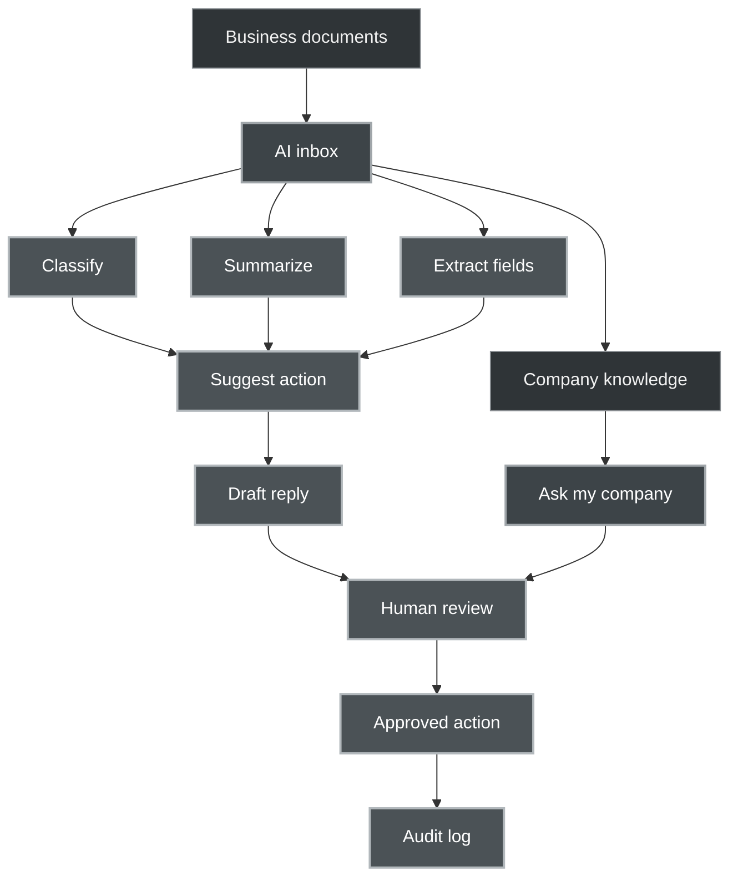
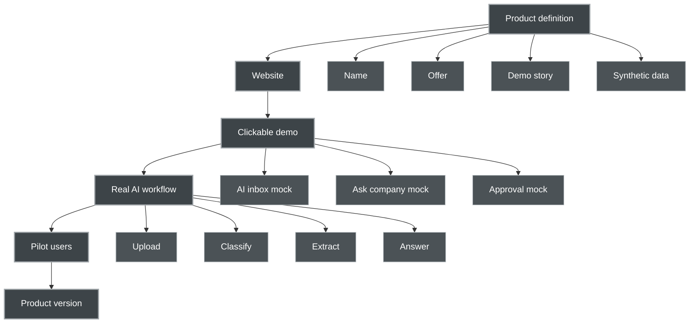
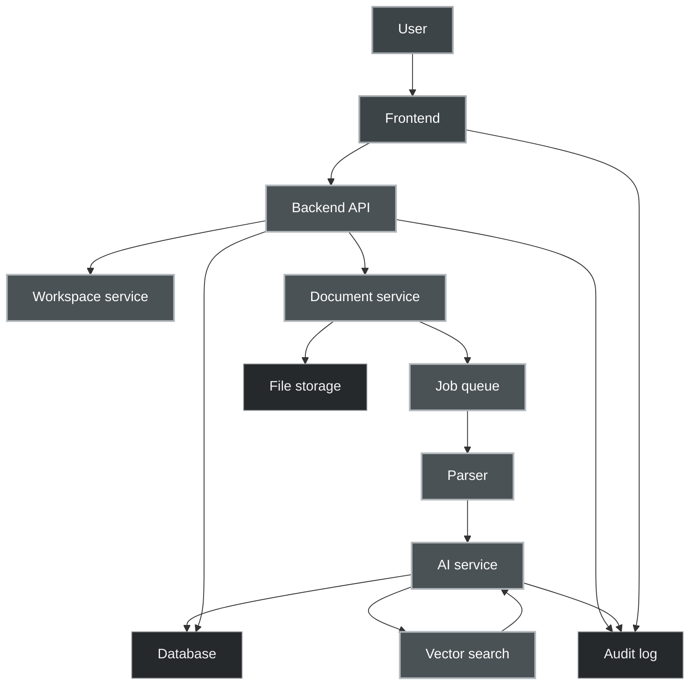
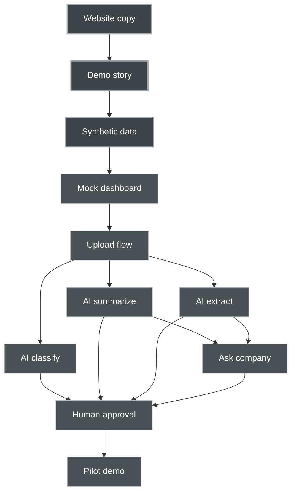

# Romanian SME AI Companion — Product Blueprint

## 1. Core Recommendation

Build the project in this order:

1. **Define the product as a website / product page first**
2. **Use that website as the public-facing specification**
3. **Build a small working demo around the exact flows shown on the website**
4. **Test the demo with 3–5 real Romanian SME workflows**
5. **Only then expand into a modular platform**

The website is not just branding. It becomes the product mirror:

- What problem we solve
- Who it is for
- What documents it handles
- What the AI actually does
- What the user sees
- What is automated
- What stays human-approved
- How data is protected
- What a pilot includes
- What is not promised

This creates clarity before writing too much code.

---

## 2. Product Working Name

### Recommended public name direction

**Business Companion**

Possible Romanian-market names:

- **CompanionOps**
- **NexusOps AI**
- **Birou AI Companion**
- **Companion pentru Afaceri**
- **DocuCompanion AI**
- **Companion Inbox**
- **Cubic Office AI**

For the first version, avoid names that sound too abstract or cosmic. The product can be powered by the deeper CSMCL architecture, but the Romanian SME buyer needs something direct and trustworthy.

Recommended positioning:

> **A private AI operations companion for Romanian SMEs — documents, invoices, emails, contracts, and company knowledge in one intelligent workspace.**

---

## 3. The Product Thesis

Romanian SMEs do not need “AI transformation” as a slogan.

They need help with:

- too many documents
- slow replies to clients
- invoice and accountant communication
- scattered company knowledge
- contracts and supplier emails
- compliance anxiety
- repeated administrative tasks
- lack of internal documentation
- fear of using AI incorrectly

The product should feel like:

> “A calm, private AI assistant that reads the company’s operational mess and turns it into clear next actions.”

---

## 4. First Product: AI Document & Operations Inbox

### Core concept

A company forwards or uploads business documents into one workspace.

The system classifies, summarizes, extracts, routes, and prepares next actions.

### Inputs

- PDFs
- scanned documents
- invoices
- contracts
- supplier offers
- client emails
- HR documents
- accountant requests
- public company procedures
- product sheets
- Excel/CSV files later
- ANAF/SPV/e-Factura exports later

### Outputs

- document type
- summary
- extracted fields
- urgency level
- missing information
- suggested action
- draft reply
- assigned category/person
- searchable company knowledge
- audit trail

---

## 5. Primary Modules

## Module 1 — AI Inbox

The central workspace.

Each uploaded/forwarded item becomes an AI-analyzed card.

Card fields:

- Document title
- Type: invoice, contract, email, HR, supplier offer, client request, unknown
- Short summary
- Extracted data
- Urgency
- Risk flags
- Missing information
- Suggested next action
- Status: new, reviewed, assigned, done, archived
- Human approval marker

### Example

A supplier invoice arrives.

The AI card shows:

- Type: Supplier invoice
- Supplier: Example SRL
- Amount: 3,420 RON
- Due date: 17 May 2026
- Missing: purchase order reference
- Suggested action: ask supplier for PO reference and forward invoice to accountant
- Draft email prepared

---

## Module 2 — Ask My Company

A private company knowledge assistant.

The user can ask questions over uploaded documents.

Examples:

- “Which invoices are due this week?”
- “Summarize the contract with Supplier X.”
- “What did we agree about payment terms?”
- “Which client emails are waiting for a reply?”
- “Draft a reply based on our standard policy.”
- “What documents should I send to the accountant?”

Important rule:

The assistant should answer based only on company documents unless the user explicitly enables outside knowledge.

---

## Module 3 — Email Reply Assistant

The system reads incoming client/supplier/accountant emails and prepares replies.

Human approval is required before sending.

Capabilities:

- summarize email thread
- identify requested action
- detect missing information
- draft Romanian/English replies
- keep tone professional
- prepare accountant-forwarding notes
- create task from email

---

## Module 4 — Document Extraction

Structured extraction from operational documents.

Initial extraction fields:

### Invoice

- supplier name
- CUI/VAT number
- invoice number
- date
- due date
- amount
- currency
- VAT
- IBAN
- status
- missing fields

### Contract

- parties
- start date
- end date
- renewal clause
- payment terms
- penalties
- obligations
- termination clause
- risks

### Client request

- requester
- topic
- urgency
- required reply
- missing details
- suggested next step

---

## Module 5 — Human Approval & Audit

This is essential for trust.

The AI should not silently act on important business items.

Actions should be marked as:

- AI suggested
- human reviewed
- human approved
- sent/exported
- archived

Every AI-generated answer should keep source references where possible.

This avoids the “AI black box” feeling.

---

## Module 6 — AI Literacy & Safe Use Layer

A small but powerful trust module.

It explains to the company:

- what the AI can do
- what it cannot do
- what data it uses
- where the data is stored
- how hallucinations are reduced
- when human approval is required
- what employees should not upload
- how sensitive data is handled

This can become part of the paid onboarding package.

---

## 6. Website Structure

The first website should be a product definition website, not a generic agency website.

### Page 1 — Home

Goal: explain the product in 10 seconds.

Hero message:

> **Your company documents, emails, invoices, and contracts — organized by a private AI companion.**

Sub-message:

> Built for Romanian SMEs that want less paperwork, faster replies, and safer access to company knowledge.

Primary CTA:

> Request a Pilot

Secondary CTA:

> See Example Workflow

Sections:

1. Problem
2. What it does
3. Demo workflow
4. Modules
5. Trust & privacy
6. Pilot offer
7. Contact

---

### Page 2 — Product

Explain modules in detail:

- AI Inbox
- Ask My Company
- Email Assistant
- Document Extraction
- Human Approval
- Audit Log
- Safe AI Use

Each module should have one real example.

---

### Page 3 — Demo Workflow

This is the most important page.

Show a realistic business scenario.

Scenario:

> A Romanian SME receives supplier invoices, a client request, and an accountant email. The AI Companion reads everything, classifies the items, extracts important information, prepares replies, and shows what needs human approval.

Demo steps:

1. Upload documents or forward emails
2. AI creates inbox cards
3. AI extracts key data
4. AI flags missing information
5. AI drafts reply
6. Human approves
7. Task is completed or exported

This page should include screenshots or mock UI cards.

---

### Page 4 — For Romanian SMEs

Speak directly to local pain:

- invoices
- accountant communication
- supplier documents
- client messages
- contracts
- HR files
- compliance anxiety
- small teams with too much admin

Tone:

Practical, calm, trustworthy.

Avoid:

- hype
- futuristic slogans
- too much “AI revolution” language
- vague “digital transformation” text

---

### Page 5 — Security & Privacy

This page is a differentiator.

Explain:

- EU hosting option
- optional local/private deployment later
- role-based access later
- no automatic public sharing
- human approval before sending
- audit logs
- source-grounded answers
- data deletion policy
- GDPR-aware design

Even if not all features are built yet, define the direction clearly and honestly.

Use labels:

- Available in MVP
- Planned
- Enterprise option

---

### Page 6 — Pilot

Sell a concrete pilot, not a vague project.

Recommended pilot offer:

> **14-day AI Operations Pilot**

Includes:

- one company workspace
- up to X uploaded documents
- 2–3 business workflows configured
- AI Inbox demo
- Ask My Company demo
- email reply drafting demo
- final report with automation opportunities

Pilot outcome:

- document map
- workflow map
- AI readiness score
- list of automations worth building
- demo workspace

---

## 7. MVP Scope

### MVP goal

Build a small but convincing product demo that proves the core value.

### MVP should include

1. User login or simple protected workspace
2. Document upload
3. AI document classification
4. AI summary
5. Basic extraction fields
6. Search / Ask My Company
7. Draft reply generation
8. Human approval status
9. Simple audit log
10. Demo dataset

### MVP should not include yet

- full ERP integration
- automatic sending without approval
- complex multi-tenant enterprise permissions
- native e-Factura integration
- SEAP/ANAF automation
- payment system
- full CRM
- advanced analytics
- mobile app

---

## 8. Demo Dataset

Create a fake but realistic Romanian SME dataset.

Business example:

**“Atelier Nova SRL”** — a small company selling services/products.

Documents:

- 5 supplier invoices
- 3 client emails
- 2 supplier offers
- 1 accountant request
- 2 contracts
- 1 HR policy
- 1 internal procedure
- 1 product/service price list

The demo must be safe and fully synthetic.

This lets you show the product without needing client data.

---

## 9. Technical Architecture Overview

Recommended architecture for development:

### Frontend

- Vue 3 or React
- Dashboard UI
- Upload area
- AI Inbox cards
- Ask My Company interface
- Document detail view
- Human approval controls

### Backend

- FastAPI, Rust, or Node depending on existing comfort
- API gateway
- document ingestion service
- classification/extraction service
- RAG service
- audit log service
- user/workspace service

### Storage

- PostgreSQL for structured data
- object storage or filesystem for documents
- vector database for embeddings
- Redis for queues/session/cache if useful

### AI Layer

- LLM provider abstraction
- local model support later
- prompt templates
- extraction prompts
- classification prompts
- RAG prompts
- evaluation tests
- fallback models

### Document Processing

- PDF parsing
- OCR later for scanned documents
- metadata extraction
- chunking
- embeddings
- source references

### Security

- workspace isolation
- access control
- encrypted storage later
- audit logs
- human approval
- data deletion flow

---

## 10. Development Phases

## Phase 0 — Product Definition

Output:

- product website copy
- module definitions
- demo workflow
- pilot package
- synthetic Romanian SME dataset
- architecture map

This is where we are now.

---

## Phase 1 — Static Website / Product Definition Site

Build the product website first.

It should include:

- homepage
- product page
- demo workflow page
- security/privacy page
- pilot page

This forces clarity.

The website becomes:

- sales page
- product spec
- demo script
- investor/partner explanation
- internal development guide

---

## Phase 2 — Clickable Mock UI

Before backend complexity, build a fake-but-realistic frontend demo.

Use static synthetic data.

Show:

- AI Inbox cards
- document detail
- Ask My Company answers
- draft email panel
- audit log

This lets potential users understand the value before full AI is wired in.

---

## Phase 3 — Real AI Prototype

Connect real AI functions:

- document upload
- extraction
- classification
- summarization
- embeddings
- RAG answers
- draft reply generation

Keep it single-workspace at first.

---

## Phase 4 — Pilot with Real Users

Test with 3–5 Romanian SMEs or trusted contacts.

Do not sell a huge system yet.

Sell a pilot:

- collect workflow pain
- process a small document set
- show what AI can automate
- collect feedback
- identify paid expansion

---

## Phase 5 — Productization

Add:

- multi-tenant workspaces
- billing
- roles
- integrations
- export features
- accountant workflow
- CRM/email integrations
- dashboard analytics

---

## 11. What to Build First in the IDE

Recommended first IDE build:

### A. Static website

Build the product definition website.

### B. Mock dashboard

Use synthetic JSON data.

Components:

- Sidebar
- AI Inbox
- Document Card
- Document Detail Panel
- Ask My Company Chat
- Draft Reply Panel
- Audit Timeline

### C. Demo scenario button

A button like:

> Load Demo Company

It loads the fake company dataset and shows the whole product flow.

This gives you something immediately demonstrable.

---

## 12. The First Demo Flow

Demo title:

> “From messy documents to clear next actions in 3 minutes.”

Flow:

1. User opens dashboard
2. Uploads or loads demo documents
3. AI Inbox fills with analyzed cards
4. User clicks supplier invoice
5. AI shows extracted fields and missing PO reference
6. User asks: “Which items need action today?”
7. AI lists urgent invoices and unanswered client emails
8. User clicks draft reply
9. AI prepares email to supplier/accountant
10. User approves or edits
11. Audit log records the action

This is powerful because it shows real operational value.

---

## 13. Important Product Principles

### Principle 1 — Show, do not claim

Every website section should show a concrete example.

Bad:

> “We empower your workflows with AI.”

Good:

> “Upload a supplier invoice. The assistant extracts amount, due date, VAT, missing fields, and prepares a note for your accountant.”

---

### Principle 2 — Human-approved AI

The product should never feel like uncontrolled automation.

The promise:

> “AI prepares. Humans approve.”

This builds trust.

---

### Principle 3 — Romanian-aware, not Romania-only

The product should understand Romanian business workflows, but should not trap itself in a tiny niche.

Good:

- Romanian documents
- Romanian language
- accountant workflows
- EU/GDPR sensitivity

But architecture should stay general enough to serve other EU SMEs later.

---

### Principle 4 — Start boring, become powerful

The market entry product should solve boring business pain.

Later, the deeper Companion architecture can emerge:

- memory
- identity
- autonomous workflows
- role-based companions
- company knowledge graph
- multi-agent routing
- private model orchestration

---

## 14. Initial Pricing Direction

Do not finalize pricing yet, but design around a pilot.

Possible pilot pricing:

- Free for first 1–2 trusted testers
- €300–€700 for a small diagnostic pilot
- €1,000–€2,500 for a configured business workflow pilot
- monthly subscription later depending on usage and integrations

Initial paid package:

### 14-Day AI Operations Pilot

Includes:

- workflow discovery
- document set analysis
- private demo workspace
- AI Inbox configuration
- final automation report

This is easier to sell than a subscription before trust exists.

---

## 15. Ideal First Customers

Avoid very large enterprises first.

Better first users:

- accounting offices
- small logistics companies
- construction/material suppliers
- clinics/dental offices
- agencies
- real estate firms
- local service companies
- e-commerce shops
- companies with many recurring documents

Best first customer type:

> A Romanian SME with 5–50 employees, too many documents, no internal AI team, and a manager who already feels paperwork is stealing time.

---

## 16. What Makes This Different

Most AI agency pages say:

> “We build custom AI solutions.”

This product says:

> “Here is the exact operational inbox your company can use. Here is the workflow. Here are the documents. Here is the human approval layer. Here is the pilot.”

Differentiators:

- Romanian SME focus
- document-first
- real demo
- private knowledge assistant
- human approval
- audit trail
- practical pilot
- transparent architecture
- no hype

---

## 17. Immediate Next Actions

### Step 1

Choose the product name and positioning sentence.

### Step 2

Write the first website structure:

- Home
- Product
- Demo Workflow
- Security
- Pilot

### Step 3

Create synthetic Romanian SME demo documents.

### Step 4

Build static product website.

### Step 5

Build mock dashboard with fake data.

### Step 6

Connect real AI functions one by one.

Recommended first AI functions:

1. summarize document
2. classify document
3. extract invoice fields
4. answer from uploaded documents
5. draft reply

---

## 18. Final Recommendation

Yes: define it first as a website.

But make the website a **product operating map**, not only a landing page.

The website should answer:

- What is the product?
- Who is it for?
- What exact workflows does it solve?
- What documents does it understand?
- What does the user see?
- What can be demonstrated today?
- What requires human approval?
- What is included in a pilot?
- Why should a Romanian SME trust this?

Once this exists, development becomes much easier.

The first real goal is not a finished platform.

The first goal is:

> **A believable product website + a clickable demo + one working AI workflow.**

That is enough to start conversations, test the market, and avoid building too much in the wrong direction.


---

# 19. Prompt Pack — From Product Definition to Build

This prompt pack is designed to guide the project from concept to website, clickable demo, AI prototype, and pilot readiness.

Use the prompts sequentially. Each prompt should produce an artifact that becomes input for the next prompt.

The process:

1. Product identity
2. Target customer
3. Product offer
4. Website structure
5. Website copy
6. Demo scenario
7. Synthetic dataset
8. Dashboard UX
9. Technical architecture
10. MVP backlog
11. AI workflow prompts
12. Testing and evaluation
13. Pilot package
14. Outreach and discovery

---

## 19.1 Master Project Orchestrator Prompt

Use this at the beginning of a planning session.

```text
You are my product strategy, architecture, and implementation partner.

We are building an AI product for Romanian SMEs.

The product is a private AI operations companion that helps companies manage documents, invoices, contracts, emails, accountant communication, and internal company knowledge.

The first version should not be a generic chatbot. It should be a practical AI Document & Operations Inbox with an Ask My Company knowledge assistant.

Our goals are:
1. Define the product clearly.
2. Create a product-definition website.
3. Build a clickable dashboard demo using synthetic Romanian SME data.
4. Implement one real AI workflow.
5. Prepare a small pilot offer for Romanian SMEs.

Important principles:
- Show concrete workflows, not vague AI claims.
- AI prepares, humans approve.
- The product must feel trustworthy, practical, Romanian-aware, and GDPR-conscious.
- Start with boring but valuable business pain.
- Avoid overbuilding before market feedback.

Your task is to help me move step by step.
For each step, produce clear output that can be used directly in development, website copy, product documentation, or implementation planning.

Start by helping me define the product identity, positioning, and first market wedge.
```

---

## 19.2 Product Identity Prompt

Use this to choose the product name, tone, and positioning.

```text
Help me define the product identity for a Romanian SME AI operations companion.

Context:
The product helps small and medium Romanian companies manage documents, invoices, contracts, emails, accountant communication, and company knowledge using AI.

The product should feel:
- practical
- trustworthy
- calm
- technically serious
- Romanian-aware
- not hype-driven
- not like a generic AI agency

Avoid language like:
- digital transformation
- next-generation AI
- revolutionary AI solution
- empower your business
- AI-powered innovation

Generate:
1. 10 possible product names.
2. 5 positioning statements.
3. 5 one-line homepage hero messages.
4. 5 short taglines.
5. Recommended tone of voice.
6. Words to use.
7. Words to avoid.
8. The strongest name + positioning combination and why.
```

---

## 19.3 Target Customer Prompt

Use this to define who the first product is for.

```text
Define the ideal first customer profile for our Romanian SME AI operations companion.

The product helps with:
- document overload
- invoices
- contracts
- supplier emails
- client requests
- accountant communication
- company knowledge search
- draft replies
- human-approved AI actions

Generate:
1. The best first customer segments in Romania.
2. The top 5 segments to avoid at the beginning.
3. The strongest beachhead segment.
4. The daily pain points of that segment.
5. The buying triggers.
6. The objections they will have.
7. How to answer each objection.
8. What demo would convince them.
9. What data/documents they would be willing to test with.
10. What a realistic pilot should include.

Be practical. Focus on customers who could realistically buy or test this within 30–60 days.
```

---

## 19.4 Product Offer Prompt

Use this to define the first commercial offer.

```text
Design the first commercial offer for our Romanian SME AI operations companion.

We do not want to sell a huge platform immediately.
We want a clear pilot package that reduces risk and creates trust.

Product concept:
A private AI Document & Operations Inbox with an Ask My Company assistant.

Generate:
1. A 14-day pilot offer.
2. A 30-day pilot offer.
3. What is included.
4. What is excluded.
5. What the customer must provide.
6. What we deliver at the end.
7. Possible pricing ranges.
8. Success metrics.
9. A simple contract/scope outline.
10. A short sales description for the website.

Make it specific enough that a Romanian SME owner understands exactly what they get.
```

---

## 19.5 Website Structure Prompt

Use this before writing the actual website.

```text
Create the full website structure for our Romanian SME AI operations companion.

The website is not just marketing. It is the product definition layer.

Pages needed:
- Home
- Product
- Demo Workflow
- For Romanian SMEs
- Security & Privacy
- Pilot
- Contact

For each page, generate:
1. Page goal.
2. Target visitor mindset.
3. Main message.
4. Section structure.
5. CTA.
6. Example content ideas.
7. What proof/demo element should appear.
8. What not to say.

The site should feel practical, serious, clear, and trustworthy.
Avoid generic AI startup language.
```

---

## 19.6 Website Copy Prompt — Homepage

Use this to generate the homepage copy.

```text
Write the homepage copy for our Romanian SME AI operations companion.

Product:
A private AI Document & Operations Inbox for Romanian SMEs.
It helps organize documents, invoices, emails, contracts, accountant communication, and company knowledge.

Tone:
- direct
- calm
- practical
- trustworthy
- no hype
- Romanian SME friendly

Homepage sections:
1. Hero
2. Problem
3. What the product does
4. Example workflow
5. Product modules
6. Human approval and trust
7. Pilot offer
8. Final CTA

Requirements:
- Avoid generic AI language.
- Use concrete examples.
- Mention that AI prepares and humans approve.
- Make the product feel real even before a full backend exists.
- Use short paragraphs.
- Include CTA button text.

Produce full copy ready to paste into a website.
```

---

## 19.7 Website Copy Prompt — Product Page

```text
Write the Product page copy for our Romanian SME AI operations companion.

Core modules:
1. AI Inbox
2. Ask My Company
3. Email Reply Assistant
4. Document Extraction
5. Human Approval & Audit Log
6. Safe AI Use Layer

For each module, include:
- what it does
- example input
- example output
- business value
- trust/safety note

Tone:
Practical, clear, Romanian SME focused, no hype.

End the page with a CTA for a pilot.
```

---

## 19.8 Demo Workflow Prompt

Use this to create the most important page and demo script.

```text
Design a realistic demo workflow for our Romanian SME AI operations companion.

The demo should show how a small Romanian company goes from messy documents to clear next actions.

Use a fake company called Atelier Nova SRL.

The demo should include:
- supplier invoice
- client request email
- accountant email
- small contract
- supplier offer
- internal procedure

Generate:
1. Demo story.
2. Step-by-step user flow.
3. Screens shown at each step.
4. AI output shown at each step.
5. What the human approves.
6. What value is obvious to the buyer.
7. Text for the Demo Workflow website page.
8. A short 3-minute live demo script.

The demo must be concrete and believable.
```

---

## 19.9 Synthetic Dataset Prompt

Use this to create safe fake demo documents.

```text
Create a synthetic Romanian SME demo dataset for our AI Document & Operations Inbox.

Company name: Atelier Nova SRL
Business type: small Romanian service/product company
Purpose: demo only, no real personal data

Create realistic sample content for:
1. 5 supplier invoices
2. 3 client emails
3. 2 supplier offers
4. 1 accountant request
5. 2 short contracts
6. 1 HR/internal policy
7. 1 internal procedure
8. 1 service price list

For each document, provide:
- filename
- document type
- realistic text content
- key fields expected to be extracted
- expected AI summary
- expected urgency
- expected suggested action

Make the documents realistic enough for testing classification, extraction, summarization, and RAG.
Keep all names, CUI numbers, IBANs, emails, and addresses synthetic.
```

---

## 19.10 Dashboard UX Prompt

Use this before building the UI.

```text
Design the dashboard UX for our Romanian SME AI operations companion.

Core screens:
1. Workspace home
2. AI Inbox
3. Document detail panel
4. Ask My Company assistant
5. Draft reply panel
6. Audit log
7. Settings / data privacy

Use synthetic data from Atelier Nova SRL.

Generate:
1. Information architecture.
2. Main navigation.
3. Components per screen.
4. Card layouts.
5. Empty states.
6. Loading states.
7. Error states.
8. Human approval interactions.
9. Trust indicators.
10. Copy/microcopy for important buttons and labels.

Design principle:
The user should understand the product in under 3 minutes.
```

---

## 19.11 Frontend Implementation Prompt

Use this inside the IDE assistant when creating the first mock frontend.

```text
Build a frontend mock dashboard for an AI Document & Operations Inbox.

Use static synthetic JSON data. Do not connect a backend yet.

Product context:
Romanian SME AI operations companion for documents, invoices, emails, contracts, accountant communication, and company knowledge.

Required screens/components:
- Layout with sidebar
- AI Inbox list
- Document cards
- Filter by document type/status/urgency
- Document detail panel
- Extracted fields section
- Suggested action section
- Draft reply panel
- Ask My Company chat mock
- Audit timeline
- Human approval button states

Use clean, professional styling.
The product should feel trustworthy, practical, and not overdesigned.

Create well-structured components and keep the mock data separated from UI logic.
Use realistic Romanian SME sample data.
```

---

## 19.12 Technical Architecture Prompt

Use this before backend development.

```text
Design the technical architecture for our Romanian SME AI operations companion.

Product modules:
- AI Inbox
- document upload
- document parsing
- document classification
- field extraction
- summarization
- Ask My Company RAG assistant
- draft reply generation
- human approval
- audit log
- workspace/user management

Constraints:
- Start simple.
- Build an MVP first.
- Make it modular enough to expand later.
- Prefer EU/GDPR-aware data handling.
- Avoid overengineering.
- Support local/private deployment later if needed.

Generate:
1. High-level architecture.
2. Service/module boundaries.
3. Suggested database schema.
4. API endpoints.
5. Document ingestion pipeline.
6. Vector search/RAG pipeline.
7. AI provider abstraction.
8. Queue/background job needs.
9. Audit logging model.
10. Security considerations.
11. MVP version vs later version.
12. Recommended development order.
```

---

## 19.13 Backend MVP Prompt

Use this inside the IDE assistant for backend planning/implementation.

```text
Help me build the backend MVP for an AI Document & Operations Inbox.

MVP features:
1. Create workspace.
2. Upload document.
3. Store document metadata.
4. Parse text from document.
5. Classify document type.
6. Summarize document.
7. Extract basic fields for invoices and emails.
8. Store AI analysis result.
9. Expose inbox API.
10. Expose document detail API.
11. Create audit log entries.

Keep the first version simple and testable.

Generate:
- folder structure
- database schema
- API route list
- processing flow
- background job design if needed
- error handling strategy
- test plan

Do not add unnecessary enterprise features yet.
```

---

## 19.14 AI Classification Prompt

This is a runtime prompt template for classifying uploaded documents.

```text
You are an AI document classifier for a Romanian SME operations inbox.

Classify the document into exactly one of these types:
- supplier_invoice
- client_invoice
- contract
- supplier_offer
- client_request
- accountant_request
- hr_document
- internal_procedure
- price_list
- unknown

Return only valid JSON with this schema:

{
  "document_type": "one_of_the_allowed_types",
  "confidence": 0.0,
  "reason": "short explanation",
  "language": "ro|en|mixed|unknown",
  "detected_entities": {
    "company_names": [],
    "people_names": [],
    "dates": [],
    "amounts": [],
    "emails": []
  }
}

Document text:
---
{{DOCUMENT_TEXT}}
---
```

---

## 19.15 AI Summary Prompt

Runtime prompt template.

```text
You are an AI operations assistant for a Romanian SME.

Summarize the document for a busy business owner.

Requirements:
- Be concise.
- Mention what the document is about.
- Mention any deadlines, amounts, obligations, or requested actions.
- Mention missing information if obvious.
- Do not invent details.
- If information is unclear, say so.

Return valid JSON:

{
  "short_summary": "1-2 sentence summary",
  "key_points": [],
  "deadlines": [],
  "amounts": [],
  "obligations": [],
  "missing_information": [],
  "recommended_next_action": "clear practical action",
  "urgency": "low|medium|high|unknown"
}

Document text:
---
{{DOCUMENT_TEXT}}
---
```

---

## 19.16 Invoice Extraction Prompt

Runtime prompt template.

```text
You are an AI extraction engine for Romanian business invoices.

Extract invoice information from the document.

Rules:
- Return only valid JSON.
- Do not invent missing fields.
- Use null when a field is not found.
- Preserve original currency and date format if uncertain.
- Flag suspicious or missing data.

Schema:

{
  "supplier_name": null,
  "supplier_cui": null,
  "supplier_vat_number": null,
  "invoice_number": null,
  "invoice_date": null,
  "due_date": null,
  "total_amount": null,
  "vat_amount": null,
  "currency": null,
  "iban": null,
  "payment_status": "unknown",
  "line_items": [
    {
      "description": null,
      "quantity": null,
      "unit_price": null,
      "amount": null
    }
  ],
  "missing_fields": [],
  "risk_flags": [],
  "recommended_next_action": null
}

Invoice text:
---
{{DOCUMENT_TEXT}}
---
```

---

## 19.17 Contract Review Prompt

Runtime prompt template.

```text
You are an AI assistant helping a Romanian SME understand a business contract.

You are not a lawyer and you must not provide legal advice.
Your task is to summarize operationally relevant information and flag clauses that need human/legal review.

Return valid JSON:

{
  "contract_type": null,
  "parties": [],
  "start_date": null,
  "end_date": null,
  "payment_terms": [],
  "obligations": [],
  "termination_terms": [],
  "penalties": [],
  "renewal_clause": null,
  "important_dates": [],
  "risk_flags": [],
  "questions_for_human_review": [],
  "plain_language_summary": "short summary",
  "recommended_next_action": "practical next step"
}

Contract text:
---
{{DOCUMENT_TEXT}}
---
```

---

## 19.18 Email Reply Draft Prompt

Runtime prompt template.

```text
You are an AI assistant drafting a business email reply for a Romanian SME.

Context:
The AI prepares drafts, but a human must review and approve before sending.

Write a professional reply based only on the provided email/thread and company context.

Rules:
- Do not invent commitments.
- If information is missing, ask for clarification.
- Keep the tone polite, clear, and practical.
- Use Romanian unless the original email is in English.
- Do not send the email. Only draft it.

Return valid JSON:

{
  "detected_language": "ro|en|mixed|unknown",
  "reply_subject": "draft subject",
  "reply_body": "draft email body",
  "assumptions": [],
  "missing_information": [],
  "human_review_required": true,
  "recommended_next_action": "what the human should check before sending"
}

Incoming email/thread:
---
{{EMAIL_TEXT}}
---

Relevant company context:
---
{{COMPANY_CONTEXT}}
---
```

---

## 19.19 Ask My Company RAG Prompt

Runtime prompt template.

```text
You are a private company knowledge assistant for a Romanian SME.

Answer the user's question using only the provided company context.

Rules:
- If the answer is not in the provided context, say that the information was not found.
- Do not invent policies, dates, prices, legal obligations, or commitments.
- Cite the source document names when possible.
- Keep the answer practical and concise.
- If the question requires human/accountant/legal review, say so clearly.

Return valid JSON:

{
  "answer": "clear answer",
  "source_documents": [],
  "confidence": "low|medium|high",
  "missing_information": [],
  "recommended_next_action": null,
  "requires_human_review": false
}

User question:
---
{{USER_QUESTION}}
---

Company context:
---
{{RETRIEVED_CONTEXT}}
---
```

---

## 19.20 Human Approval Decision Prompt

Runtime prompt template for suggesting approval state.

```text
You are an AI operations assistant.

Review the proposed AI action and decide whether it is safe to present for human approval.

You must not approve the action yourself.
You only recommend whether the action is ready for human review or needs more information.

Return valid JSON:

{
  "ready_for_human_review": true,
  "blocking_issues": [],
  "items_human_should_check": [],
  "risk_level": "low|medium|high",
  "suggested_status": "ready_for_review|needs_more_information|do_not_send",
  "explanation": "short explanation"
}

Original document/email:
---
{{SOURCE_TEXT}}
---

Proposed AI action:
---
{{PROPOSED_ACTION}}
---
```

---

## 19.21 AI Evaluation Prompt

Use this to evaluate whether outputs are good enough.

```text
Evaluate the AI output for a Romanian SME operations assistant.

Check for:
1. Accuracy.
2. Whether the AI invented information.
3. Whether important dates, amounts, obligations, or risks were missed.
4. Whether the tone is appropriate.
5. Whether human review is correctly required.
6. Whether the output is useful for a business owner.
7. Whether the JSON format is valid.

Return:

{
  "score": 0-10,
  "passed": true_or_false,
  "issues": [],
  "hallucinations_detected": [],
  "missing_critical_information": [],
  "format_errors": [],
  "recommended_improvements": []
}

Original input:
---
{{INPUT_TEXT}}
---

AI output:
---
{{AI_OUTPUT}}
---
```

---

## 19.22 MVP Backlog Prompt

Use this to convert the project into build tasks.

```text
Create an MVP backlog for our Romanian SME AI operations companion.

MVP goal:
A believable product website, clickable dashboard demo, and one working AI document workflow.

Break the work into:
1. Website tasks.
2. Frontend dashboard tasks.
3. Backend tasks.
4. AI pipeline tasks.
5. Data/model tasks.
6. Security/privacy tasks.
7. Testing tasks.
8. Demo/pilot preparation tasks.

For each task include:
- task title
- user story
- acceptance criteria
- priority
- estimated complexity: small/medium/large
- dependencies

Keep the backlog practical and buildable by a small team.
```

---

## 19.23 README / Repository Prompt

Use this when starting the repo.

```text
Create a README.md for the repository of our Romanian SME AI operations companion.

The README should explain:
- what the project is
- product goal
- MVP scope
- architecture overview
- tech stack placeholders
- local development setup
- folder structure
- environment variables
- demo dataset
- AI workflow overview
- human approval principle
- security/privacy notes
- roadmap

Tone:
Clear, practical, developer-friendly.
Do not oversell.
```

---

## 19.24 Pilot Discovery Call Prompt

Use this when preparing customer interviews.

```text
Create a discovery call script for Romanian SME owners/managers who may test our AI Document & Operations Inbox.

Goal:
Understand their document/email/accountant workflow and determine whether our pilot is useful.

Generate:
1. Opening explanation.
2. 15 discovery questions.
3. Questions about invoices.
4. Questions about emails/client requests.
5. Questions about accountant communication.
6. Questions about contracts/documents.
7. Questions about current tools.
8. Questions about data/privacy concerns.
9. How to explain the pilot.
10. How to close the call.
11. Red flags that they are not a good pilot customer.

Keep it natural and non-salesy.
```

---

## 19.25 Outreach Email Prompt

Use this to contact early testers.

```text
Write a short outreach email in Romanian and English for Romanian SME owners/managers.

Context:
We are testing a private AI Document & Operations Inbox that helps with invoices, emails, contracts, accountant communication, and company knowledge.

Goal:
Invite them to a short discovery call or pilot.

Tone:
- human
- practical
- not spammy
- not hype-driven
- clear about being an early pilot

Include:
1. Subject lines.
2. Romanian version.
3. English version.
4. Short LinkedIn message version.
5. Follow-up message.
```

---

## 19.26 Security & Privacy Page Prompt

Use this to define trust language.

```text
Write the Security & Privacy page for our Romanian SME AI operations companion.

Important principles:
- AI prepares, humans approve.
- Company documents are private.
- Answers should be grounded in uploaded company context.
- Audit logs are important.
- EU/GDPR-aware design.
- Be honest about MVP vs planned features.

Create sections:
1. Our trust principle.
2. What data the system uses.
3. What the AI can and cannot do.
4. Human approval.
5. Audit trail.
6. Data storage direction.
7. GDPR-aware design.
8. MVP features vs planned features.
9. Customer responsibilities.
10. Contact for privacy questions.

Tone:
Transparent, calm, concrete.
Do not make legal guarantees unless clearly framed as goals or design principles.
```

---

## 19.27 Product Demo Video Script Prompt

Use this once mock UI exists.

```text
Write a 3-minute product demo video script for our Romanian SME AI operations companion.

Demo scenario:
Atelier Nova SRL has supplier invoices, client emails, an accountant request, and a contract.
The AI Document & Operations Inbox organizes the mess into clear next actions.

The script should include:
1. Opening problem.
2. Dashboard introduction.
3. AI Inbox walkthrough.
4. Invoice extraction example.
5. Ask My Company example.
6. Draft reply example.
7. Human approval explanation.
8. Pilot CTA.

Tone:
Clear, calm, practical, Romanian SME friendly.
Avoid hype.
```

---

## 19.28 Project Review Prompt

Use this after each phase.

```text
Review our current project state for the Romanian SME AI operations companion.

Inputs I will provide:
- current website copy
- current UI screenshots or description
- current architecture
- current backlog
- current demo flow

Evaluate:
1. Is the product clear?
2. Is the market wedge strong?
3. Is the website concrete enough?
4. Is the demo convincing?
5. Is the MVP too large?
6. What should be removed?
7. What should be built next?
8. What would confuse a Romanian SME buyer?
9. What proof is still missing?
10. What is the next best action?

Be direct and practical.
```

---

# 20. Recommended Prompt Sequence

Use the prompts in this order:

1. **Master Project Orchestrator Prompt**
2. **Product Identity Prompt**
3. **Target Customer Prompt**
4. **Product Offer Prompt**
5. **Website Structure Prompt**
6. **Homepage Copy Prompt**
7. **Product Page Prompt**
8. **Demo Workflow Prompt**
9. **Synthetic Dataset Prompt**
10. **Dashboard UX Prompt**
11. **Frontend Implementation Prompt**
12. **Technical Architecture Prompt**
13. **Backend MVP Prompt**
14. **MVP Backlog Prompt**
15. **Runtime AI Prompts**
16. **Evaluation Prompt**
17. **Pilot Discovery Prompt**
18. **Outreach Prompt**
19. **Project Review Prompt**

The most important sequence for immediate progress:

1. Product Identity
2. Website Structure
3. Homepage Copy
4. Demo Workflow
5. Synthetic Dataset
6. Dashboard UX
7. Frontend Mock

This gives us a visible product definition before deep backend work begins.

---

# 21. Practical Working Method

For each phase, use this loop:

1. Ask for the artifact with one of the prompts.
2. Review the output.
3. Simplify it.
4. Convert it into a website section, mock UI, code task, or runtime prompt.
5. Build only the next smallest useful piece.
6. Test it with the synthetic demo company.
7. Repeat.

Avoid trying to build the full system at once.

The project should move like this:

> Product clarity → website → mock demo → one real AI workflow → pilot conversation → product refinement.

This keeps the work grounded, visible, and market-testable.

---

# 22. Mermaid Diagrams

The diagrams below use simple Mermaid syntax and a muted dark gray visual style.

Recommended use:

- Put these in the project README.
- Reuse them in the product website planning docs.
- Keep them updated as the product changes.

---

## 22.1 Product Flow Diagram



---

## 22.2 Project Roadmap Diagram



---

## 22.3 System Architecture Diagram



---

## 22.4 Simple MVP Dependency Diagram



---

## 22.5 Notes on Mermaid Style

Keep Mermaid labels simple:

- avoid slashes
- avoid quotes
- avoid parentheses
- avoid long text inside nodes
- avoid special characters where possible
- use short node names
- explain details outside the diagram

Recommended palette:

- background feeling: charcoal gray
- standard node: `#2f3437`
- main node: `#3d4448`
- action node: `#4b5256`
- storage node: `#25292c`
- stroke: `#8a8f93`
- bright stroke: `#b2b8bc`
- text: `#f2f2f2`

This gives the diagrams a darker, grayish style without becoming unreadable.
