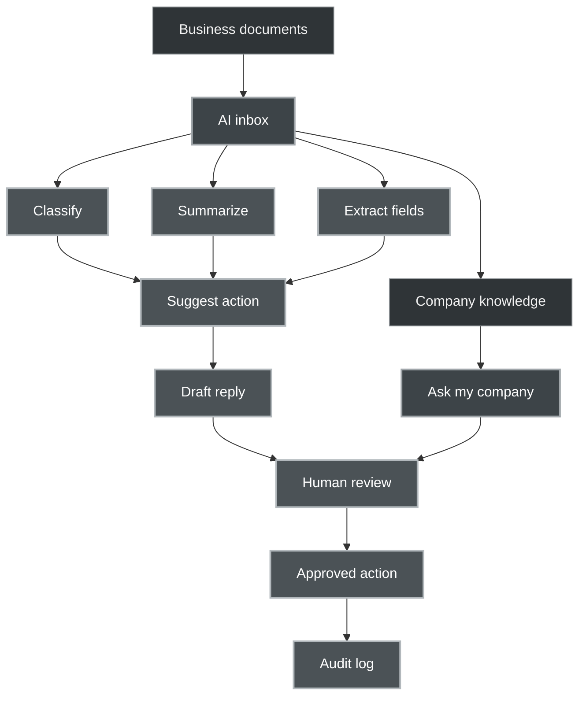
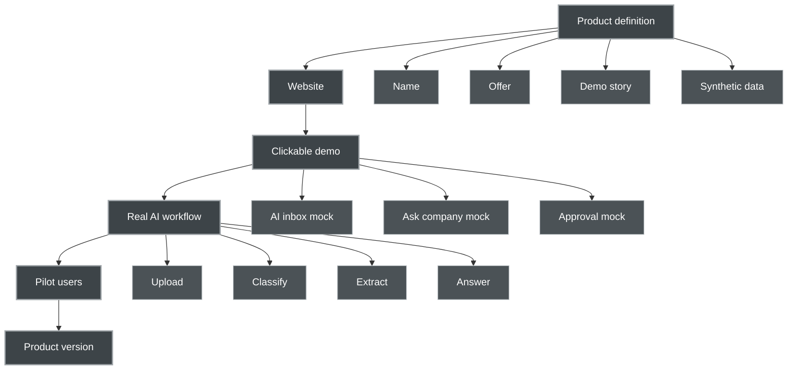
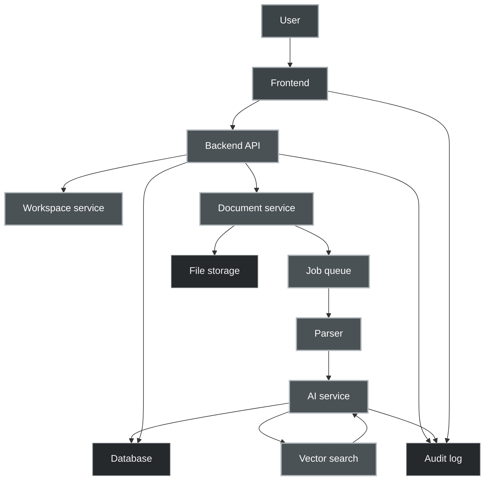
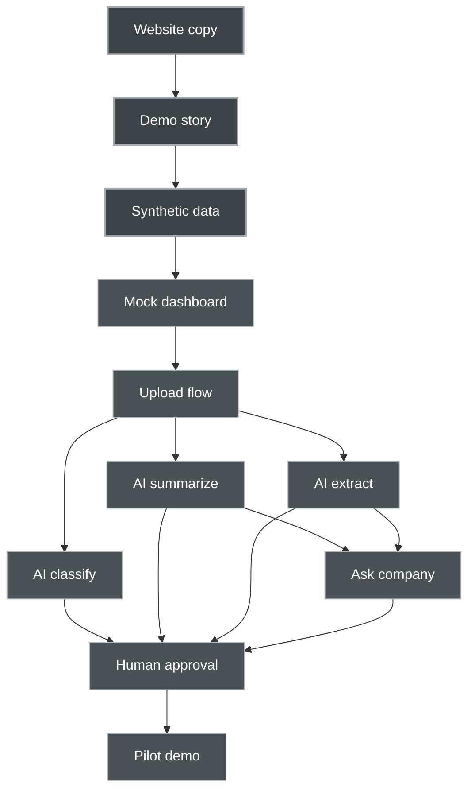

# 22. Mermaid Diagrams

The diagrams below use simple Mermaid syntax and a muted dark gray visual style.

Recommended use:

- Put these in the project README.
- Reuse them in the product website planning docs.
- Keep them updated as the product changes.

---

## 22.1 Product Flow Diagram

---

## 22.2 Project Roadmap Diagram

---

## 22.3 System Architecture Diagram

---

## 22.4 Simple MVP Dependency Diagram

---

## 22.5 Notes on Mermaid Style

Keep Mermaid labels simple:

- avoid slashes
- avoid quotes
- avoid parentheses
- avoid long text inside nodes
- avoid special characters where possible
- use short node names
- explain details outside the diagram

Recommended palette:

- background feeling: charcoal gray
- standard node: `#2f3437`
- main node: `#3d4448`
- action node: `#4b5256`
- storage node: `#25292c`
- stroke: `#8a8f93`
- bright stroke: `#b2b8bc`
- text: `#f2f2f2`

This gives the diagrams a darker, grayish style without becoming unreadable.

---