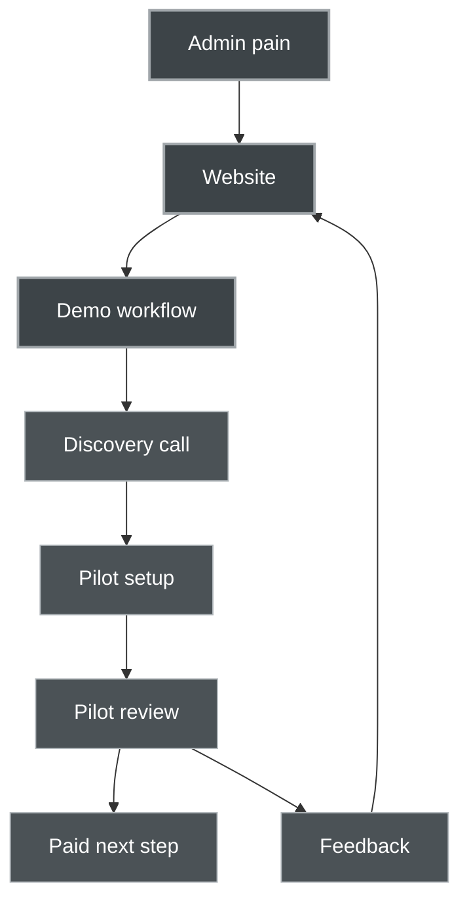

# 23. Project Control Pack

This pack exists to keep the project grounded.

The blueprint gives the full vision. The control pack gives the practical anchors:

- what the product is
- what the MVP includes
- what the MVP does not include
- what we demonstrate
- how we evaluate AI quality
- how we talk to early users
- how we record technical decisions

Use this section when the project feels too large.

---

# 23.1 One Page Product Brief

## Product Name

Working name:

**Business Companion AI**

Alternative internal name:

**Romanian SME AI Operations Companion**

The final public name can still change. For now, the working name is clear enough to guide development.

---

## One Sentence Description

**Business Companion AI is a private AI operations workspace that helps Romanian SMEs organize documents, invoices, emails, contracts, accountant communication, and company knowledge into clear next actions.**

---

## Short Description

Romanian SMEs often lose time inside scattered documents, repeated email threads, invoices, supplier messages, contracts, and accountant requests.

Business Companion AI gives them one calm workspace where documents and messages are classified, summarized, extracted, searched, and turned into human-approved next actions.

The product does not replace people. It prepares work for people.

Core principle:

> **AI prepares. Humans approve.**

---

## Target Customer

Best first customer:

**Romanian SMEs with 5 to 50 employees that handle many recurring documents and client or supplier messages, but do not have an internal AI or automation team.**

Best initial segments:

1. Accounting offices
2. Small service companies
3. Construction and installation companies
4. Clinics and dental offices
5. Agencies and consultancies
6. Small logistics or trade companies
7. E-commerce and product businesses

Avoid at the beginning:

- large enterprises with complex procurement
- highly regulated institutions requiring long compliance review
- customers needing full ERP integration from day one
- customers asking for autonomous AI decisions without human review
- customers with unclear data ownership or privacy constraints

---

## Main Pain

The customer does not wake up thinking:

> “I need AI.”

They think:

- I have too many documents.
- I lose time searching emails.
- I forget what was agreed in contracts.
- I do not know which invoices need attention.
- The accountant keeps asking for missing files.
- Client requests are scattered.
- My team repeats the same replies.
- We have knowledge, but it is not organized.

The product should speak to these pains, not to abstract AI excitement.

---

## Core Workflow

1. A company uploads or forwards documents and emails.
2. The AI Inbox creates structured cards.
3. Each card receives classification, summary, extracted fields, urgency, and suggested action.
4. The user asks questions in Ask My Company.
5. The AI drafts replies or next steps.
6. A human reviews and approves.
7. Actions and decisions are recorded in the audit log.

---

## Core Modules

### 1. AI Inbox

The central view for analyzed documents and messages.

### 2. Ask My Company

A private assistant that answers from company documents only.

### 3. Document Extraction

Extracts invoice, contract, email, and operational fields.

### 4. Draft Reply Assistant

Prepares replies to clients, suppliers, or accountants.

### 5. Human Approval

Prevents uncontrolled automation.

### 6. Audit Log

Records AI suggestions, human decisions, and completed actions.

---

## MVP Promise

The MVP should prove this:

> A Romanian SME can give the system a small set of documents and immediately see what they are, what they mean, what is missing, and what action should happen next.

---

## Pilot Promise

The pilot should promise this:

> In 14 days, we analyze one small operational workflow, configure a demo AI workspace, and show which document or email tasks can realistically be assisted by AI.

---

## Differentiation

Most AI companies say:

> “We build AI solutions.”

This product says:

> “Here is your messy document workflow. Here is how the AI organizes it. Here is what it extracts. Here is what it suggests. Here is what a human approves.”

The difference is concrete workflow proof.

---

## Positioning Statement

**For Romanian SMEs drowning in documents, invoices, emails, and repeated administrative work, Business Companion AI is a private AI operations inbox that turns scattered business information into clear, human-approved next actions.**

---

## The One Minute Explanation

Business Companion AI helps Romanian SMEs organize their daily operational documents.

Instead of searching through emails, invoices, contracts, accountant requests, and internal files manually, the company gets an AI Inbox. Each document is classified, summarized, checked for key fields, and turned into a suggested next action.

The user can also ask questions like:

- Which invoices need attention?
- What did this contract say about payment?
- What documents should I send to the accountant?
- Draft a reply to this client.

The AI does not act silently. It prepares, and a human approves.

---

# 23.2 MVP Boundary Document

The MVP boundary protects the project from becoming too large too early.

The goal is not to build the full platform.

The goal is to build enough to prove:

1. The product is understandable.
2. The workflow is useful.
3. The AI can process business documents safely.
4. Early users can imagine using it.
5. We can run a small pilot.

---

## MVP Includes

### Product Definition

- Product website
- Product positioning
- Clear module descriptions
- Demo workflow page
- Security and privacy page
- Pilot offer page

### Demo Dataset

- Synthetic Romanian SME company
- Fake invoices
- Fake client emails
- Fake supplier offers
- Fake accountant request
- Fake contracts
- Fake internal procedure
- Fake price list

### Clickable Dashboard

- AI Inbox screen
- Document card list
- Document detail panel
- Extracted fields section
- Suggested action section
- Draft reply panel
- Ask My Company mock
- Audit timeline
- Human approval states

### Real AI Workflow

At least one working real workflow:

1. Upload document
2. Parse text
3. Classify document
4. Summarize document
5. Extract basic fields
6. Show result in inbox
7. Save audit event

### Basic RAG

- Upload or load documents
- Chunk text
- Embed chunks
- Retrieve relevant chunks
- Answer questions from context
- Return source document names

### Trust Layer

- Human review required
- AI output marked as suggestion
- Basic audit log
- Clear disclaimers for legal/accounting review
- No autonomous sending

---

## MVP Does Not Include Yet

### Business Integrations

- No ERP integration
- No ANAF/SPV integration
- No native e-Factura integration
- No SEAP integration
- No accounting software integration
- No CRM integration

### Advanced Automation

- No automatic email sending
- No automatic payments
- No autonomous contract approval
- No automatic supplier communication without review
- No advanced multi-agent workflows

### Enterprise Features

- No complex multi-tenant permissions
- No SSO
- No enterprise procurement workflows
- No custom compliance packages
- No advanced admin console

### Productization

- No payment system
- No subscription billing
- No usage metering
- No app marketplace
- No mobile app

### Advanced AI

- No fine-tuning at first
- No custom Romanian model training at first
- No complex agent autonomy
- No long-running autonomous workflows
- No legal or accounting advice engine

---

## MVP Success Criteria

The MVP succeeds if a viewer can understand in under 3 minutes:

1. What problem the product solves.
2. What the AI Inbox does.
3. What Ask My Company does.
4. How human approval works.
5. Why this is useful for a Romanian SME.
6. What a pilot would include.

The technical MVP succeeds if the system can:

1. Load a demo company.
2. Show realistic analyzed documents.
3. Process one real uploaded document.
4. Classify and summarize it.
5. Extract at least invoice fields.
6. Answer a simple question from documents.
7. Record an audit event.

---

## MVP Risk Controls

### Risk: Too much scope

Control:

Only build the first document workflow before integrations.

### Risk: AI hallucination

Control:

Use source-grounded answers and evaluation prompts.

### Risk: Trust concerns

Control:

Human approval, privacy page, audit trail, clear limitations.

### Risk: Generic product

Control:

Always show concrete Romanian SME examples.

### Risk: Building without feedback

Control:

Prepare pilot conversations as soon as the clickable demo exists.

---

## MVP North Star

> **One workspace. One demo company. One real document workflow. One clear pilot offer.**

---

# 23.3 Synthetic Demo Company Pack

This pack defines the fake company used for demos, frontend mock data, AI tests, and website examples.

All data must remain synthetic.

No real CUI, IBAN, address, person, or company data should be used.

---

## Demo Company

Company name:

**Atelier Nova SRL**

Business type:

Small Romanian company offering interior design services, small renovation coordination, and custom decorative products.

Location:

Pitești, Romania

Team size:

12 employees

Business situation:

Atelier Nova receives many supplier invoices, client requests, offers, contracts, and accountant messages. Documents arrive through email, PDFs, scans, and shared folders. The manager wants a simple way to know what needs attention.

---

## Demo Personas

### Owner Manager

Name:

**Irina Popescu**

Role:

Owner and general manager

Pain:

Too many documents and messages, not enough time to organize them.

### Accountant Contact

Name:

**Mihai Ionescu**

Role:

External accountant

Pain:

Receives incomplete documents and has to ask for missing details.

### Office Assistant

Name:

**Andrei Marin**

Role:

Handles suppliers, emails, and document uploads

Pain:

Does not always know which documents are urgent.

### Sales Contact

Name:

**Elena Dobre**

Role:

Handles client requests and offers

Pain:

Client emails need faster replies.

---

## Demo Document List

### Supplier Invoices

1. `invoice_lumina_design_2026_0041.pdf`
2. `invoice_mobila_artisan_2026_0187.pdf`
3. `invoice_printstudio_2026_0098.pdf`
4. `invoice_curier_rapid_2026_1142.pdf`
5. `invoice_softcloud_2026_0520.pdf`

### Client Emails

1. `email_client_apartament_bucuresti.txt`
2. `email_client_showroom_pitesti.txt`
3. `email_client_intarziere_livrare.txt`

### Supplier Offers

1. `offer_lumina_led_panels.txt`
2. `offer_mobila_custom_shelves.txt`

### Accountant Request

1. `email_accountant_missing_docs_april.txt`

### Contracts

1. `contract_supplier_lumina_design.txt`
2. `contract_client_showroom_renovation.txt`

### Internal Documents

1. `policy_hr_remote_work.txt`
2. `procedure_client_project_intake.txt`
3. `price_list_services_2026.txt`

---

## Example Document Content 1

Filename:

`invoice_lumina_design_2026_0041.pdf`

Document type:

Supplier invoice

Content:

```text
Factura seria LD nr. 0041
Data emiterii: 28.04.2026
Furnizor: Lumina Design SRL
CUI: RO00000001
Client: Atelier Nova SRL
CUI Client: RO00000002

Produse:
1. Panouri LED decorative model Aurora, 12 buc, 185 RON/buc
2. Cablu alimentare și accesorii montaj, 1 set, 340 RON

Subtotal: 2.560 RON
TVA: 486,40 RON
Total de plată: 3.046,40 RON
Scadență: 12.05.2026
IBAN: RO00BANK0000000000000001

Mențiune: Comanda internă nu este trecută pe factură.
```

Expected extraction:

```json
{
  "supplier_name": "Lumina Design SRL",
  "supplier_cui": "RO00000001",
  "invoice_number": "LD 0041",
  "invoice_date": "28.04.2026",
  "due_date": "12.05.2026",
  "total_amount": "3046.40",
  "currency": "RON",
  "vat_amount": "486.40",
  "missing_fields": ["internal purchase order reference"],
  "recommended_next_action": "Ask supplier or internal team to confirm the purchase order reference, then forward to accountant."
}
```

Expected summary:

> Supplier invoice from Lumina Design SRL for LED decorative panels and accessories, total 3,046.40 RON, due on 12.05.2026. The internal purchase order reference is missing.

Urgency:

High

---

## Example Document Content 2

Filename:

`email_accountant_missing_docs_april.txt`

Document type:

Accountant request

Content:

```text
Subiect: Documente lipsă pentru luna aprilie

Bună, Irina,

Pentru închiderea lunii aprilie am nevoie de următoarele documente:

1. Factura de la Lumina Design SRL pentru panourile LED.
2. Confirmarea plății către PrintStudio pentru materialele promoționale.
3. Contractul semnat cu clientul pentru proiectul Showroom Pitești.
4. Explicație pentru factura SoftCloud, deoarece nu apare persoana care a aprobat abonamentul.

Te rog să mi le trimiți până pe 10 mai ca să putem finaliza raportarea la timp.

Mulțumesc,
Mihai
```

Expected extraction:

```json
{
  "requester": "Mihai",
  "deadline": "10 mai",
  "requested_documents": [
    "Factura Lumina Design SRL",
    "Confirmarea plății către PrintStudio",
    "Contract semnat Showroom Pitești",
    "Explicație pentru factura SoftCloud"
  ],
  "recommended_next_action": "Collect the four requested documents and reply to the accountant before 10 May."
}
```

Expected summary:

> The accountant requests four missing April documents by 10 May, including supplier invoices, payment confirmation, a signed client contract, and approval explanation for SoftCloud.

Urgency:

High

---

## Example Document Content 3

Filename:

`email_client_apartament_bucuresti.txt`

Document type:

Client request

Content:

```text
Subiect: Cerere ofertă amenajare apartament 3 camere

Bună ziua,

Am găsit portofoliul Atelier Nova și am dori o ofertă pentru amenajarea unui apartament de 3 camere în București, aproximativ 78 mp.

Ne interesează:
- consultanță design interior
- propunere cromatică
- recomandări mobilier
- eventual coordonare furnizori

Am vrea să începem în luna iunie. Ne puteți spune ce informații aveți nevoie și care este un cost estimativ?

Mulțumesc,
Radu Enache
```

Expected summary:

> Potential client asks for an interior design offer for a 78 sqm apartment in Bucharest, with a desired start in June. They need a reply explaining required information and estimated cost.

Expected suggested action:

> Send a polite reply asking for floor plan, photos, preferred style, budget range, and desired level of service. Include a rough starting price based on the service price list if available.

Urgency:

Medium

---

## Example Document Content 4

Filename:

`contract_supplier_lumina_design.txt`

Document type:

Supplier contract

Content:

```text
Contract de colaborare nr. 12 din 15.03.2026

Părți:
Lumina Design SRL, în calitate de furnizor
Atelier Nova SRL, în calitate de beneficiar

Obiect:
Furnizarea de corpuri de iluminat decorative, panouri LED și accesorii pentru proiectele Atelier Nova.

Termen de livrare:
Furnizorul livrează produsele în termen de 7 zile lucrătoare de la confirmarea comenzii.

Plată:
Beneficiarul achită facturile în termen de 14 zile calendaristice de la data emiterii facturii.

Penalități:
Pentru întârzieri la plată mai mari de 10 zile, se pot aplica penalități de 0,05% pe zi din suma restantă.

Durată:
Contractul este valabil până la 31.12.2026 și se poate prelungi prin acord scris.

Încetare:
Oricare parte poate denunța contractul cu notificare scrisă transmisă cu 30 de zile înainte.
```

Expected summary:

> Supplier contract with Lumina Design SRL for lighting products. Invoices must be paid within 14 calendar days, delivery should happen within 7 working days after order confirmation, and late payment penalties may apply after more than 10 days.

Risk flags:

- payment penalties after late payment
- renewal requires written agreement
- termination requires 30 days notice

---

## Example Ask My Company Questions

These questions should work in the demo:

1. Which invoices are urgent this week?
2. What documents did the accountant request?
3. What is missing from the Lumina Design invoice?
4. What are the payment terms with Lumina Design?
5. Draft a reply to the apartment client.
6. Which documents mention Showroom Pitești?
7. What should I send to the accountant before 10 May?
8. Are there any contracts with payment penalties?

---

## Demo Dataset Design Rule

Every synthetic document should include at least one useful signal:

- date
- amount
- missing information
- requested action
- contract obligation
- client need
- supplier condition
- deadline
- approval requirement

This makes the demo feel alive and gives the AI something meaningful to extract.

---

# 23.4 User Journey Map

This journey shows how a Romanian SME moves from first contact to pilot.

---

## Stage 1 — Awareness

User state:

The owner or manager feels overwhelmed by documents, emails, invoices, and repeated admin work.

They may not be looking for AI directly.

They may search for:

- document automation
- invoice processing
- AI assistant for business
- email automation
- digitalization for SMEs
- reduce admin work

Website must answer:

> “Can this help with my daily operational mess?”

---

## Stage 2 — Website Visit

User sees:

- clear headline
- concrete workflow
- example AI Inbox cards
- human approval principle
- pilot offer

User should think:

> “This is not just AI hype. This looks like something I understand.”

Primary action:

Request pilot or discovery call.

---

## Stage 3 — Demo Workflow

User watches or reads:

- upload invoice
- AI classifies it
- AI extracts due date and amount
- AI finds missing information
- AI suggests action
- human approves

User should think:

> “This is exactly the kind of thing we lose time with.”

---

## Stage 4 — Discovery Call

Goal:

Understand whether the company has a workflow worth piloting.

Questions:

- Where do invoices arrive?
- Who handles them?
- What gets lost?
- What does the accountant ask repeatedly?
- Which documents cause delays?
- How many emails need repeated replies?

Outcome:

Choose one small workflow for the pilot.

---

## Stage 5 — Pilot Setup

Customer provides:

- small sample document set
- example workflow
- preferred language
- privacy constraints
- desired output

We provide:

- configured demo workspace
- AI Inbox
- document analysis
- summary of automation opportunities

---

## Stage 6 — Pilot Review

Customer sees:

- analyzed documents
- extracted fields
- suggested actions
- Ask My Company answers
- draft replies
- audit log

The key question:

> “Would this save your team time every week?”

---

## Stage 7 — Paid Next Step

Possible outcomes:

### Outcome A

They want a configured monthly workspace.

### Outcome B

They want one workflow automated first.

### Outcome C

They need internal approval.

### Outcome D

They are not ready, but give useful feedback.

---

## User Journey Diagram



---

# 23.5 Prompt Registry

Prompts are product components.

They should be versioned, tested, and reviewed like code.

Each prompt should have:

- name
- version
- purpose
- input variables
- output format
- failure cases
- evaluation method
- owner notes

---

## Registry Table

| Prompt Name | Version | Purpose | Input | Output | Priority |
|---|---:|---|---|---|---|
| document_classifier | v1 | Detect document type | document text | JSON classification | High |
| document_summary | v1 | Summarize document | document text | JSON summary | High |
| invoice_extractor | v1 | Extract invoice fields | invoice text | JSON invoice fields | High |
| contract_review | v1 | Operational contract summary | contract text | JSON contract summary | Medium |
| email_reply_draft | v1 | Draft business replies | email and context | JSON draft email | High |
| ask_company | v1 | Answer from company context | user question and retrieved context | JSON answer | High |
| approval_check | v1 | Check if action is ready for human review | source and proposed action | JSON approval recommendation | Medium |
| output_evaluator | v1 | Evaluate AI output quality | input and output | JSON evaluation | High |

---

## Prompt Card Template

Use this template for every prompt.

```text
Prompt name:

Version:

Purpose:

Used by module:

Input variables:

Expected output:

JSON schema:

Failure cases:

Safety rules:

Evaluation method:

Example input:

Example output:

Notes:
```

---

## Prompt Card 1 — document_classifier

Prompt name:

`document_classifier`

Version:

`v1`

Purpose:

Classify uploaded documents into operational document types.

Used by module:

AI Inbox

Input variables:

- `DOCUMENT_TEXT`

Expected output:

JSON with document type, confidence, reason, language, and detected entities.

Failure cases:

- document too short
- OCR failure
- mixed document types
- poor formatting
- unknown language

Safety rules:

- do not invent document type
- use unknown when uncertain
- confidence must reflect uncertainty

Evaluation method:

Compare predicted type against expected type in synthetic dataset.

Target quality:

90 percent correct on clean synthetic documents before pilot.

---

## Prompt Card 2 — invoice_extractor

Prompt name:

`invoice_extractor`

Version:

`v1`

Purpose:

Extract structured fields from Romanian business invoices.

Used by module:

Document Extraction

Input variables:

- `DOCUMENT_TEXT`

Expected output:

JSON invoice fields.

Important fields:

- supplier name
- supplier CUI
- invoice number
- invoice date
- due date
- total amount
- VAT amount
- currency
- IBAN
- missing fields
- risk flags
- recommended next action

Failure cases:

- scanned invoice OCR errors
- missing due date
- multiple totals
- unclear VAT
- handwritten notes

Safety rules:

- use null for missing fields
- never invent CUI, IBAN, or amount
- flag uncertainty

Evaluation method:

Compare extracted fields against expected JSON from synthetic dataset.

Target quality:

High accuracy on amount, due date, supplier name, and invoice number.

---

## Prompt Card 3 — ask_company

Prompt name:

`ask_company`

Version:

`v1`

Purpose:

Answer user questions using only retrieved company context.

Used by module:

Ask My Company

Input variables:

- `USER_QUESTION`
- `RETRIEVED_CONTEXT`

Expected output:

JSON answer with sources, confidence, missing information, next action, and human review flag.

Failure cases:

- context does not contain answer
- retrieved chunks are irrelevant
- user asks legal or accounting advice
- question needs external knowledge

Safety rules:

- answer only from context
- say when information is not found
- cite source document names
- mark human review when needed

Evaluation method:

Ask known questions over synthetic dataset and compare answer to expected answer.

Target quality:

No hallucinated answers in test set.

---

## Prompt Versioning Rule

Never silently change a runtime prompt.

Use versions:

- `v1`
- `v1.1`
- `v2`

Record:

- what changed
- why it changed
- whether output format changed
- whether tests were updated

---

# 23.6 AI Evaluation Checklist

This checklist keeps the AI honest.

Use it on every core output before trusting the workflow.

---

## Classification Evaluation

Check:

- Is the document type correct?
- Is confidence reasonable?
- Did the model choose unknown when uncertain?
- Did it detect language correctly?
- Did it avoid overclaiming?

Pass condition:

The classification is correct or uncertainty is clearly expressed.

Fail condition:

The model confidently assigns the wrong type.

---

## Summary Evaluation

Check:

- Is the summary accurate?
- Are dates included?
- Are amounts included?
- Are obligations included?
- Are missing fields mentioned?
- Is the next action practical?
- Is anything invented?

Pass condition:

A business owner can read the summary and understand what to do next.

Fail condition:

The summary omits a critical deadline, amount, or requested action.

---

## Extraction Evaluation

Check:

- Supplier name correct?
- CUI correct?
- Invoice number correct?
- Date correct?
- Due date correct?
- Total correct?
- Currency correct?
- VAT correct?
- Missing fields detected?
- Risk flags reasonable?

Pass condition:

Critical fields are correct, and missing fields are not invented.

Fail condition:

The model invents or changes financial data.

---

## RAG Answer Evaluation

Check:

- Is the answer grounded in retrieved context?
- Are source documents listed?
- Does it admit when information is missing?
- Does it avoid outside assumptions?
- Does it flag human review when needed?

Pass condition:

The answer can be traced to source documents.

Fail condition:

The model gives an answer not present in the company context.

---

## Email Draft Evaluation

Check:

- Is the tone appropriate?
- Is the language correct?
- Does it avoid invented promises?
- Does it ask for missing information when needed?
- Is human review required?
- Is the subject clear?

Pass condition:

The draft is useful and safe for a human to edit.

Fail condition:

The draft commits the company to something not supported by the context.

---

## Human Approval Evaluation

Check:

- Is the action ready for human review?
- Are blocking issues listed?
- Are risks visible?
- Is the suggested status appropriate?
- Does it avoid approving automatically?

Pass condition:

The user understands what to check before approving.

Fail condition:

The system makes approval feel automatic or hides uncertainty.

---

## Evaluation Score Template

```json
{
  "test_case": "invoice_lumina_design_2026_0041",
  "prompt_name": "invoice_extractor",
  "prompt_version": "v1",
  "score": 8,
  "passed": true,
  "critical_errors": [],
  "minor_errors": ["IBAN spacing normalized differently"],
  "hallucinations": [],
  "missing_information": [],
  "notes": "Extraction is acceptable for MVP demo."
}
```

---

## Minimum Quality Before Pilot

Before using real pilot data, the synthetic dataset should pass:

- classification accuracy above 90 percent
- no hallucinated invoice amounts
- no hallucinated due dates
- RAG answers grounded in documents
- email drafts always marked human review required
- JSON valid in normal cases
- unclear documents marked unknown or low confidence

---

# 23.7 Pilot Discovery Script

Use this with Romanian SME owners, managers, accountants, or office administrators.

The goal is not to sell hard.

The goal is to understand the workflow and find one useful pilot path.

---

## Opening Explanation

Romanian version:

```text
Lucrăm la un produs AI practic pentru firme mici și mijlocii din România.

Ideea este simplă: multe firme pierd timp cu facturi, documente, emailuri, contracte și cereri de la contabilitate. Noi testăm un inbox AI privat care poate organiza aceste documente, le poate rezuma, poate extrage informații importante și poate pregăti următorii pași pentru aprobare umană.

Nu vrem să înlocuim oamenii și nu vrem ca AI-ul să ia decizii singur. Vrem să vedem unde poate pregăti munca mai repede, iar omul să aprobe.

Aș vrea să înțeleg cum funcționează fluxul vostru astăzi și dacă există un caz mic unde ar merita testat.
```

English version:

```text
We are building a practical AI product for Romanian SMEs.

The idea is simple: many companies lose time with invoices, documents, emails, contracts, and accountant requests. We are testing a private AI inbox that can organize these items, summarize them, extract important information, and prepare next actions for human approval.

We do not want AI to replace people or make uncontrolled decisions. We want AI to prepare the work faster, while humans stay in control.

I would like to understand how your workflow works today and whether there is one small use case worth testing.
```

---

## Discovery Questions

### General Workflow

1. What types of documents create the most repetitive work for you?
2. Where do those documents usually arrive?
3. Who is responsible for checking them?
4. What gets delayed most often?
5. What information do you search for repeatedly?

### Invoices

6. How do supplier invoices arrive today?
7. Who checks due dates, amounts, and missing information?
8. Do you often need to ask suppliers or colleagues for corrections?
9. What does the accountant usually ask for?
10. How many invoices do you handle in a normal month?

### Emails and Client Requests

11. Do client requests arrive through email, website forms, WhatsApp, or other channels?
12. Are there repeated replies your team writes often?
13. What kind of messages need faster response?
14. Do you ever lose track of unanswered messages?
15. Would draft replies be useful if a human approves them before sending?

### Contracts and Documents

16. Where are contracts stored?
17. How do you find payment terms or deadlines inside contracts?
18. Are there supplier conditions people forget?
19. Do you need summaries of contracts or only key fields?
20. Which documents would be safe to test with?

### Accountant Communication

21. How does your accountant request documents?
22. What is usually missing?
23. How often do you need to collect documents for monthly reporting?
24. Would a checklist of missing documents help?
25. Would automatic summaries for the accountant help?

### Privacy and Trust

26. What data would you not want to upload to an AI system?
27. Would EU hosting matter to you?
28. Would you prefer local/private deployment later?
29. Who should be allowed to see analyzed documents?
30. What would make you trust or distrust this kind of system?

---

## Pilot Qualification Questions

Ask these near the end:

1. Is there one workflow that costs you time every week?
2. Could we test with 10 to 30 sample documents?
3. Would synthetic or anonymized documents be acceptable for the first test?
4. Who would review the AI results?
5. What would count as a successful pilot for you?

---

## Good Pilot Signals

A good pilot customer says things like:

- We lose time with this every week.
- The accountant asks for missing documents often.
- We have too many repeated emails.
- We search contracts manually.
- We can provide sample documents.
- We want human approval.
- We care about privacy but are open to testing.

---

## Bad Pilot Signals

Avoid or delay customers who say:

- We want AI to fully replace a person immediately.
- We need full ERP integration before seeing anything.
- We cannot provide even anonymized samples.
- We want legal/accounting advice without human review.
- We need enterprise compliance from day one.
- We are only curious but have no real workflow pain.

---

## Pilot Closing Explanation

```text
Based on what you described, the best first test would be a small workflow, not the whole company.

We would take a limited set of documents, configure an AI Inbox, show classification, summaries, extracted fields, suggested actions, and draft replies where useful.

At the end, we would review together what worked, what failed, and whether there is a real business case for a next step.
```

---

# 23.8 Architecture Decision Log

This log records important product and technical decisions.

It prevents confusion later.

---

## Decision Log Template

```text
Decision ID:

Date:

Decision:

Context:

Options considered:

Chosen option:

Reason:

Tradeoffs:

Review later:
```

---

## Initial Decisions

### Decision 001 — Start with document inbox

Decision:

The first product wedge is an AI Document & Operations Inbox.

Reason:

Documents, invoices, emails, and accountant requests are concrete Romanian SME pains. This is easier to demonstrate than a generic AI assistant.

Tradeoff:

The product may appear less futuristic, but it will be more understandable and sellable.

Review later:

After 3 to 5 pilot conversations.

---

### Decision 002 — Website before backend platform

Decision:

Build the product definition website before deep backend implementation.

Reason:

The website forces clarity around audience, workflow, modules, trust, and pilot offer.

Tradeoff:

Some technical work is delayed, but the build becomes more focused.

Review later:

After homepage and demo workflow are written.

---

### Decision 003 — Synthetic data first

Decision:

Use a synthetic Romanian SME dataset before using real customer data.

Reason:

This avoids privacy risk and allows public demo material.

Tradeoff:

Synthetic data may not capture all messy real-world cases.

Review later:

After first pilot candidate provides anonymized examples.

---

### Decision 004 — Human approval required

Decision:

The AI prepares suggestions, but humans approve actions.

Reason:

This builds trust and reduces operational, legal, and reputational risk.

Tradeoff:

Less automation at first, but safer adoption.

Review later:

After repeated low-risk workflows are validated.

---

### Decision 005 — RAG answers from company documents only

Decision:

Ask My Company answers should use uploaded company context only unless outside knowledge is explicitly enabled.

Reason:

This reduces hallucination and builds trust.

Tradeoff:

The assistant may answer “not found” more often.

Review later:

After evaluating user expectations in pilots.

---

### Decision 006 — No autonomous sending in MVP

Decision:

The MVP will not send emails or external messages automatically.

Reason:

Drafting is useful and safer than automatic sending.

Tradeoff:

Users must still review and send manually.

Review later:

After email draft quality is consistently high.

---

### Decision 007 — Keep architecture modular but simple

Decision:

The MVP architecture should be modular enough to expand, but not split into too many services too early.

Reason:

Small team development needs speed and clarity.

Tradeoff:

Some refactoring may be needed later.

Review later:

After first real AI workflow is stable.

---

# 23.9 Practical Reading Path

Since there is a lot of material, read it in layers.

---

## First Reading

Read only:

1. One Page Product Brief
2. MVP Boundary Document
3. User Journey Map

Goal:

Feel the shape of the product.

Question to hold:

> Does this feel like a real product a Romanian SME could understand?

---

## Second Reading

Read:

1. Synthetic Demo Company Pack
2. Demo Workflow section
3. Product Flow Diagram

Goal:

See the product in motion.

Question to hold:

> Can I imagine showing this to someone in 3 minutes?

---

## Third Reading

Read:

1. Prompt Registry
2. Runtime AI Prompts
3. AI Evaluation Checklist

Goal:

See the AI layer as an engineered system, not magic.

Question to hold:

> How do we keep the AI useful, testable, and honest?

---

## Fourth Reading

Read:

1. Pilot Discovery Script
2. Pilot Offer section
3. Architecture Decision Log

Goal:

Prepare for real conversations.

Question to hold:

> What would we ask the first real customer?

---

## Fifth Reading

Read the Mermaid diagrams.

Goal:

Let the whole project become visible.

Question to hold:

> What is the smallest useful thing to build first?

---

# 23.10 Final Control Principle

When the project feels too large, return to this:

> **One Romanian SME. One messy workflow. One AI Inbox. One human-approved next action.**

That is the seed.

Everything else grows from there.
