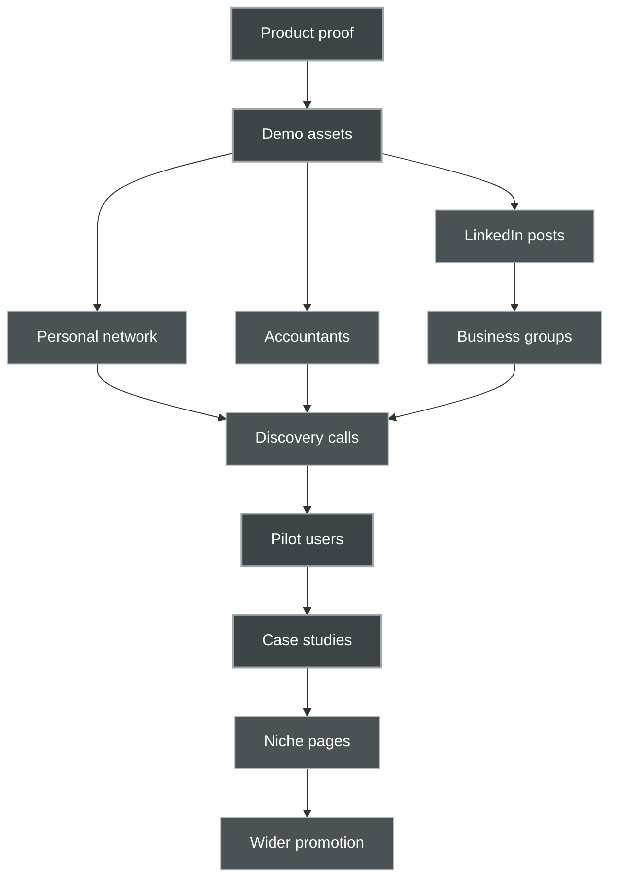

# Promotion and Go-To-Market Pack

## 1. Core Principle

Promotion for this product should be **demo-led, trust-led, and workflow-led**.

Do not promote it as a generic AI company.

Promote it as:

> **A practical AI operations inbox for Romanian SMEs that reduces document chaos, prepares replies, extracts key information, and keeps humans in control.**

The goal is for people to think:

> “This looks useful for my daily work.”

Not:

> “Another AI agency with vague AI promises.”

---

## 2. Promotion Formula

Use this formula everywhere:

```text
Pain → Small demo → Clear result → Human approval → Pilot invitation
```

Example:

```text
Pain:
Supplier invoices, client emails, contracts, and accountant requests are scattered.

Small demo:
Upload them into the AI Inbox.

Clear result:
The system classifies, summarizes, extracts due dates and missing information, and prepares next actions.

Human approval:
The manager reviews before anything is sent or completed.

Pilot invitation:
Test one workflow safely with anonymized documents.
```

This keeps promotion practical and believable.

---

## 3. Core Promotional Message

### Main Message

**Stop losing time in invoices, emails, contracts, and accountant requests. Business Companion AI turns scattered documents into clear next actions.**

### Support Message

Built for Romanian SMEs that need practical AI assistance without losing human control.

### Trust Message

AI prepares. Humans approve. Your company knowledge stays grounded in your own documents.

### Pilot Message

Start with one workflow. Test safely before committing to a larger system.

---

## 4. What Not To Say

Avoid generic AI language:

- AI transformation
- revolutionary automation
- next generation AI
- unlock the power of AI
- supercharge your business
- AI-driven innovation
- intelligent digital ecosystem
- end-to-end AI platform
- fully autonomous business assistant

These phrases sound like every other AI website.

They create distance instead of trust.

---

## 5. What To Say Instead

Use concrete workflow language:

- “Upload an invoice. See due date, amount, missing fields, and next action.”
- “Ask what documents the accountant requested.”
- “Find payment terms inside a contract.”
- “Prepare a reply to a client request.”
- “See which documents need attention this week.”
- “Keep every AI suggestion human-approved.”
- “Start with one workflow, not a huge platform.”

Concrete examples are stronger than big claims.

---

## 6. Best First Promotion Channels

## 6.1 Personal Network

This is the strongest first channel.

Who to ask:

- small business owners
- accountants
- consultants
- agency owners
- clinic owners
- construction or service company owners
- people who manage documents daily

Goal:

Not to sell immediately.

Goal is to ask:

> “Does this workflow pain exist for you?”

Example message:

```text
We are building a small AI tool for Romanian SMEs that organizes invoices, emails, contracts, and accountant requests into clear next actions.

Could I show you a 3-minute demo and ask whether this would be useful in your workflow?
```

Why this works:

The first market signal should come from real conversations, not ads.

---

## 6.2 Accountants as Referral Partners

Accountants see document chaos every month.

They know which companies are disorganized.

They know where document preparation fails.

Partner angle:

> **We help your clients prepare cleaner document packages before they reach you.**

Accountant value:

- fewer missing documents
- clearer monthly checklists
- better invoice tracking
- less back and forth
- client documents prepared before deadlines

Important:

Do not position the product as replacing accountants.

Position it as:

> **A preparation layer before accounting.**

Possible accountant outreach:

```text
We are testing an AI document inbox for small Romanian companies.

The goal is not to replace accounting work, but to help clients prepare invoices, missing documents, and monthly checklists before they send them to the accountant.

Would this reduce back-and-forth with some of your clients?
```

---

## 6.3 LinkedIn Build In Public

LinkedIn can work if posts are concrete.

Do not post generic AI thought leadership.

Post small product artifacts:

- one screenshot
- one demo card
- one invoice extraction example
- one before and after workflow
- one lesson from Romanian SME conversations
- one mistake avoided
- one human approval principle

Example post:

```text
Many SMEs do not need a chatbot.

They need this:

Invoice arrives.
AI extracts amount, due date, missing purchase order, and prepares a note for the accountant.
Human approves.

That is the kind of boring AI we are building.
Boring, useful, and safe.
```

Another example:

```text
The most important feature in our AI Inbox is not automation.

It is the approval step.

AI can classify a document, summarize it, extract due dates, and draft a reply.
But a human still approves the next action.

For Romanian SMEs, trust matters more than magic.
```

---

## 6.4 Demo Video

A short demo video is essential.

Length:

2 to 3 minutes.

Title ideas:

- “From messy documents to clear next actions”
- “AI Inbox for a Romanian SME”
- “Invoice, email, contract, accountant request — organized in 3 minutes”

Video structure:

1. Show messy inputs
2. Load AI Inbox
3. Open invoice card
4. Show extraction
5. Ask My Company question
6. Generate draft reply
7. Show human approval
8. Invite pilot

This video becomes reusable everywhere:

- website
- LinkedIn
- email outreach
- discovery calls
- partner conversations
- events

The demo video should show the product, not explain AI theory.

---

## 6.5 Local Business Groups

Potential places:

- local entrepreneur groups
- Romanian SME Facebook groups
- LinkedIn groups
- chambers of commerce
- coworking communities
- industry-specific groups
- startup meetups
- business associations

Approach:

Ask for feedback, not sales.

Example:

```text
We are testing a Romanian SME AI Inbox for invoices, emails, contracts, and accountant requests.

Would anyone here be open to giving feedback on a 3-minute demo?
```

This is softer and more effective than:

> “Buy our AI platform.”

---

## 6.6 Digitalization Hubs and SME Programs

Digitalization hubs, SME programs, and EU-funded support structures can help with credibility and distribution.

Approach:

- contact hubs
- offer a practical demo
- frame the product as SME digitalization support
- ask if they need pilot examples
- position as workflow automation, not abstract AI

Possible message:

```text
We are developing a practical AI workflow pilot for SMEs that want to reduce document and email administration.

The first demo focuses on invoices, accountant requests, contracts, and client emails.

Would this be relevant for any SMEs in your digitalization network?
```

---

## 6.7 Niche Landing Pages

Instead of one generic homepage, create specific pages for different customer types.

### For Accounting Offices

Headline:

> Help clients prepare cleaner document packages before monthly reporting.

Pain:

Clients send incomplete, scattered, or late documents.

Product angle:

AI Inbox organizes invoices, missing files, and accountant requests before reporting.

---

### For Clinics and Dental Offices

Headline:

> Organize supplier invoices, patient admin messages, and internal documents with human-approved AI.

Pain:

Administrative messages and documents interrupt daily work.

Product angle:

AI prepares summaries, replies, and document checklists.

---

### For Construction and Installation Companies

Headline:

> Keep supplier offers, invoices, contracts, and client requests organized in one AI Inbox.

Pain:

Project documents are scattered across email, WhatsApp, PDFs, and folders.

Product angle:

AI extracts deadlines, amounts, missing fields, and next actions.

---

### For Agencies and Consultancies

Headline:

> Turn client emails, contracts, offers, and project documents into clear next actions.

Pain:

Client communication is repetitive and easy to lose track of.

Product angle:

AI drafts replies, summarizes requests, and keeps project documents searchable.

---

## 7. Content Strategy

The content strategy should be practical.

Do not write abstract AI articles first.

Write content around real workflows.

### Article Ideas

1. “Why Romanian SMEs do not need an AI chatbot first”
2. “The boring AI workflow that saves time every week”
3. “How an AI Inbox handles supplier invoices”
4. “AI prepares, humans approve: a safer model for SMEs”
5. “What documents should you test before buying an AI tool?”
6. “How to prepare your company documents for AI search”
7. “Why accountants should not fear AI document assistants”
8. “From accountant email to document checklist in 30 seconds”
9. “What makes an AI answer trustworthy in company documents?”
10. “The difference between AI hype and AI workflow proof”

### Content Format

Each article should include:

- one clear problem
- one simple example
- one screenshot or diagram
- one practical lesson
- one CTA to see the demo

---

## 8. LinkedIn Post Bank

### Post 1 — Boring AI

```text
The first useful AI product for many SMEs will not look magical.

It will look boring:

- classify an invoice
- extract a due date
- find missing information
- prepare a reply
- ask for human approval

That boring layer is where trust begins.
```

---

### Post 2 — Human Approval

```text
For business AI, the most important button may be:

Approve.

Not because AI is weak.
Because companies need control.

Our approach:
AI prepares.
Humans approve.
Audit log remembers.
```

---

### Post 3 — Romanian SME Pain

```text
Many Romanian SMEs do not have an AI problem.

They have a document problem:

- invoices in email
- contracts in folders
- accountant requests in threads
- client messages in different channels
- missing information everywhere

That is where practical AI can start.
```

---

### Post 4 — Accountant Angle

```text
AI should not replace accountants.

But it can help clients send better document packages.

Imagine:
An accountant asks for missing April documents.
The AI Inbox finds the related invoices, contracts, and confirmations.
The manager reviews and sends.

Less chasing. More clarity.
```

---

### Post 5 — Demo Invitation

```text
We are preparing a 3-minute demo of an AI Inbox for Romanian SMEs.

Scenario:
A small company receives supplier invoices, client emails, a contract, and an accountant request.
The AI organizes everything into clear next actions.

Looking for a few business owners or accountants willing to give feedback.
```

---

## 9. Outreach Templates

## 9.1 Romanian Email

Subject options:

```text
Întrebare scurtă despre documentele firmei
Testăm un inbox AI pentru firme mici
Feedback pentru un demo AI practic
```

Email:

```text
Bună,

Lucrăm la un produs AI practic pentru firme mici și mijlocii din România.

Ideea este simplă: multe firme pierd timp cu facturi, emailuri, contracte și cereri de la contabilitate. Noi testăm un inbox AI care organizează aceste documente, le rezumă, extrage informații importante și pregătește următorii pași pentru aprobare umană.

Nu este un chatbot generic și nu ia decizii singur. AI-ul pregătește, omul aprobă.

Aș vrea să vă arăt un demo de 3 minute și să vă întreb sincer dacă un astfel de flux ar fi util în activitatea voastră.

Ar fi ok o discuție scurtă săptămâna viitoare?

Mulțumesc,
[Nume]
```

---

## 9.2 English Email

Subject options:

```text
Quick question about your company documents
Testing a practical AI inbox for SMEs
Feedback on a small AI workflow demo
```

Email:

```text
Hi,

We are building a practical AI product for Romanian SMEs.

The idea is simple: many companies lose time with invoices, emails, contracts, and accountant requests. We are testing an AI Inbox that organizes these documents, summarizes them, extracts key information, and prepares next actions for human approval.

It is not a generic chatbot and it does not act on its own. AI prepares, humans approve.

I would like to show you a 3-minute demo and ask whether this kind of workflow would be useful in your business.

Would you be open to a short conversation next week?

Thank you,
[Name]
```

---

## 9.3 LinkedIn Message

```text
Hi [Name], we are testing a practical AI Inbox for Romanian SMEs.

It helps organize invoices, emails, contracts, and accountant requests into clear next actions, with human approval before anything happens.

Would you be open to giving feedback on a 3-minute demo?
```

---

## 9.4 Follow Up

```text
Hi [Name], just following up.

The demo is short and practical: invoice, client email, contract, accountant request → AI Inbox → clear next actions.

No sales pressure. We are mainly looking for honest feedback from people who deal with business documents.
```

---

## 10. Demo Assets To Prepare

Before active promotion, prepare these assets:

1. One-page product page
2. 3-minute demo video
3. 5 product screenshots
4. Product flow diagram
5. One synthetic invoice example
6. One synthetic accountant request example
7. One Ask My Company example
8. One pilot offer page
9. One short Romanian outreach email
10. One short LinkedIn post

Promotion becomes much easier when these exist.

---

## 11. First 30 Days Promotion Plan

## Week 1 — Prepare Proof

Goal:

Create the assets.

Tasks:

- finish product page
- create mock dashboard
- create demo company
- create 3-minute demo script
- record or prepare demo walkthrough
- write first 5 LinkedIn posts
- prepare outreach templates

Success:

You can show the product in under 3 minutes.

---

## Week 2 — Soft Feedback

Goal:

Talk to people you already know.

Tasks:

- message 10 trusted contacts
- show demo to 3 people
- ask what feels useful or unclear
- collect exact words they use
- update website copy
- update demo flow

Success:

At least 3 useful conversations.

---

## Week 3 — Partner Discovery

Goal:

Talk to accountants and consultants.

Tasks:

- contact 10 accountants or consultants
- ask about client document problems
- test “pre-accounting document inbox” positioning
- identify one possible referral partner
- refine pilot offer

Success:

At least 1 accountant says, “Yes, my clients have this problem.”

---

## Week 4 — Public Demo Push

Goal:

Start wider visibility.

Tasks:

- publish demo video
- post 2 to 3 LinkedIn posts
- publish one article
- share in one or two business groups
- invite pilot feedback
- schedule discovery calls

Success:

At least 2 to 5 serious pilot conversations.

---

## 12. First 90 Days Promotion Plan

## Month 1 — Validate Pain

Focus:

- demo feedback
- personal network
- accountants
- small business owners

Goal:

Confirm that the document workflow pain is real.

---

## Month 2 — Run First Pilots

Focus:

- 2 to 3 small pilot workflows
- anonymized documents
- narrow use cases
- measurable time savings

Goal:

Create the first believable case studies.

---

## Month 3 — Build Proof Library

Focus:

- before and after examples
- screenshots
- testimonials
- workflow diagrams
- small case studies
- niche landing pages

Goal:

Turn early pilots into promotion assets.

---

## 13. Metrics To Track

Track simple metrics first.

### Promotion Metrics

- number of demos shown
- number of discovery calls
- number of pilot requests
- number of LinkedIn responses
- number of referrals
- number of accountants contacted

### Product Interest Metrics

- which workflow gets most interest
- which document type matters most
- which objections repeat
- which phrases people use
- what makes people trust it
- what makes people hesitate

### Pilot Metrics

- number of documents processed
- classification accuracy
- extraction accuracy
- number of useful AI suggestions
- time saved estimate
- number of human corrections
- user satisfaction

---

## 14. Objections and Answers

### Objection 1

“Is my data safe?”

Answer:

```text
The first version is designed around limited pilot data, human approval, and clear boundaries. We can start with synthetic or anonymized documents, and we do not need access to your full company system to demonstrate value.
```

---

### Objection 2

“Will AI replace my accountant or employees?”

Answer:

```text
No. The product is designed as a preparation layer. It organizes documents, extracts key information, and prepares drafts. Humans still review and approve.
```

---

### Objection 3

“What if the AI makes a mistake?”

Answer:

```text
That is why we use human approval and audit logs. The AI output is a suggestion, not an automatic decision. Critical information like amounts, deadlines, and obligations must be reviewed.
```

---

### Objection 4

“We already use folders and email.”

Answer:

```text
That works until the company needs to know quickly what is urgent, what is missing, and what needs action. The AI Inbox does not replace your files. It helps interpret and organize them.
```

---

### Objection 5

“We are too small for AI.”

Answer:

```text
That is exactly why we start with one workflow. You do not need a big platform. You can test whether AI helps with one repeated document or email process.
```

---

## 15. Promotion Roadmap Diagram



---

## 16. Final Promotion Anchor

When promotion becomes confusing, return to this:

> **Do not promote AI. Promote one useful workflow.**

The first workflow:

> **A Romanian SME receives messy documents. The AI Inbox turns them into clear next actions. A human approves.**

That is the story.

That is the demo.

That is the first market entry.

