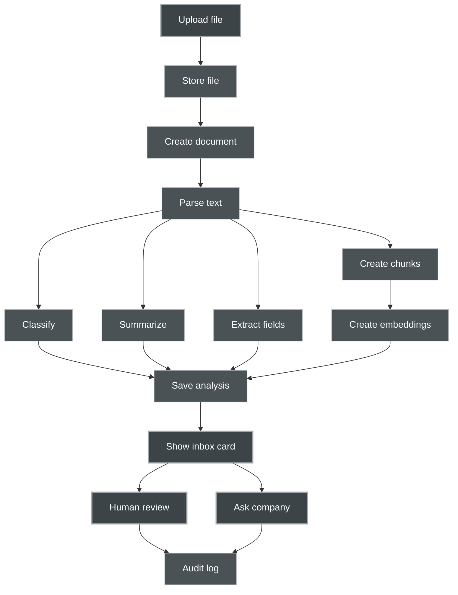

# Technical Stack Decision Pack

## 1. Stack Philosophy

The stack should help us ship a believable MVP fast, while keeping the architecture clean enough to evolve.

The first version does not need a complex enterprise platform.

It needs:

- product website
- clickable dashboard
- document upload
- document parsing
- AI classification
- AI summary
- invoice extraction
- basic RAG
- human approval
- audit log
- pilot-ready demo

Core principle:

> **Simple enough to build. Modular enough to grow. Private enough to trust.**

---

## 2. Recommended MVP Stack

## Frontend

Chosen:

- SvelteKit
- Svelte 5
- TypeScript
- Tailwind CSS
- Svelte runes and simple module state
- Mermaid for diagrams in docs

Why:

- SvelteKit gives a fresh, lightweight product surface that fits the calm, focused product feel.
- Svelte 5 runes keep state simple without a separate store library for the MVP.
- TypeScript helps keep the product clean as data structures grow.
- Tailwind makes UI iteration fast.
- One framework covers the marketing site, the demo workflow page, and the dashboard.

Use for:

- product website
- dashboard mock
- AI Inbox
- document detail view
- Ask My Company interface
- approval states
- audit timeline

MVP note:

The website and dashboard can start in the same frontend app, then split later if needed.

---

## Backend API

Recommended:

- Python
- FastAPI
- Pydantic
- SQLAlchemy or SQLModel
- Alembic

Why:

- FastAPI is very good for AI/document workflows.
- Python has the richest document processing and AI ecosystem.
- Pydantic gives structured validation for AI JSON outputs.
- This matches your existing Python AI companion and Mistral/FastAPI experience.

Use for:

- auth
- workspace API
- document upload
- document metadata
- AI analysis endpoints
- inbox API
- Ask My Company API
- audit log API

MVP note:

Do not start with Rust for the main backend unless there is a strong reason. Rust can still be used later for performance-critical services.

---

## Database

Recommended MVP:

- PostgreSQL
- pgvector extension

Why:

- One database can store users, workspaces, documents, audit logs, extracted fields, and embeddings.
- pgvector keeps vector search inside PostgreSQL for the MVP.
- This reduces infrastructure complexity.

Use for:

- users
- workspaces
- documents
- document analyses
- extracted fields
- audit events
- chunks
- embeddings
- prompt runs
- evaluation results

Later option:

Move vector search to Qdrant or Weaviate if retrieval scale, filtering, or performance demands grow.

---

## Vector Search

MVP recommendation:

- pgvector

Later recommendation:

- Qdrant for dedicated vector search
- Weaviate if we want a more complete semantic data platform

Decision:

Start with pgvector.

Reason:

The MVP needs simplicity more than specialized vector infrastructure.

---

## File Storage

MVP recommendation:

- local filesystem storage under a controlled data directory

Better near-production option:

- MinIO

Why:

- Local files are fastest for MVP.
- MinIO gives S3-compatible object storage when deployment becomes more serious.

Use for:

- uploaded PDFs
- text extraction output
- original files
- generated previews

Decision:

Start with local storage. Design the storage interface so it can switch to MinIO later.

---

## Background Jobs

MVP stage 1:

- FastAPI BackgroundTasks for very simple async work

MVP stage 2:

- Redis
- Celery

Why:

Document parsing, OCR, embeddings, and AI extraction should not block the HTTP request.

Start simple, but move to a real worker queue once processing becomes more than a few seconds.

Use for:

- parse document
- OCR document
- classify document
- summarize document
- extract fields
- create embeddings
- run evaluation

Decision:

Start with simple background tasks only if enough. Move to Redis plus Celery as soon as jobs need retry, status, or longer processing.

---

## Document Processing

Recommended MVP path:

1. text-based PDF extraction
2. Docling for richer document parsing
3. Tesseract OCR fallback for scanned documents
4. manual correction workflow later

Why:

Romanian SMEs will have messy PDFs, scans, tables, invoices, and email attachments.

We should not assume clean text only.

Use for:

- PDF invoices
- contracts
- supplier offers
- internal procedures
- scanned documents later

Decision:

Start with text PDFs and simple documents. Add OCR after the first workflow works.

---

## AI Layer

Recommended:

- internal AI service module
- provider adapter pattern
- LiteLLM optional as AI gateway
- support local and remote models

Provider adapters:

- local Mistral server
- OpenAI-compatible APIs
- Mistral API
- Ollama/local model later
- fallback provider later

Why:

We should avoid locking the product to one model provider.

Use for:

- classification
- summarization
- extraction
- email drafts
- RAG answers
- evaluation prompts

Decision:

Build a small internal `AIProvider` interface first. Add LiteLLM if provider routing, cost tracking, or multi-provider support becomes useful.

---

## LLM Orchestration

MVP recommendation:

- no heavy framework at first
- prompt templates in files
- Pydantic schemas for structured outputs
- explicit service functions

Later options:

- LangGraph for complex agent workflows
- LlamaIndex for advanced RAG pipelines
- custom CSMCL orchestration layer

Decision:

Do not start with a heavy agent framework.

Reason:

The first product is not autonomous agents. It is document workflow assistance.

---

## Authentication

MVP recommendation:

- simple email/password or admin-created accounts
- JWT sessions or secure server sessions

Pilot recommendation:

- manually created pilot workspaces

Later:

- magic links
- SSO
- organization roles
- LDAP integration if aligned with CSMCL infrastructure

Decision:

Keep auth simple for MVP. Do not let auth complexity slow down the product demo.

---

## Deployment

Recommended MVP deployment:

- Docker Compose
- Nginx reverse proxy
- HTTPS with Let’s Encrypt
- PostgreSQL container or managed Postgres
- Redis container when needed
- local file volume or MinIO

Recommended environments:

- local development
- staging demo
- pilot deployment

Decision:

Use Docker Compose first. Avoid Kubernetes.

---

## Observability

MVP:

- structured logs
- request IDs
- prompt run logs
- AI output logs
- error logs

Later:

- OpenTelemetry
- Prometheus/Grafana
- Sentry
- cost and token tracking

Important:

For AI workflows, logging prompt runs and outputs is not optional. It is how we debug quality.

---

## Testing

MVP tests:

- unit tests for extraction parsing
- API tests
- prompt output schema tests
- synthetic dataset evaluation tests
- RAG answer grounding tests

Core test idea:

Every synthetic document should have expected output.

The system should compare AI output to expected fields.

---

# 3. Recommended Monorepo Structure

```text
business-companion-ai/

  apps/
    web/
      src/
      public/
      package.json

    api/
      app/
        main.py
        api/
        core/
        db/
        models/
        schemas/
        services/
        workers/
        prompts/
        tests/
      pyproject.toml

  packages/
    shared-types/
    demo-data/

  infra/
    docker-compose.yml
    nginx/
    postgres/
    minio/

  docs/
    product/
    architecture/
    prompts/
    diagrams/
    pilot/

  scripts/
    seed_demo_data.py
    run_evaluations.py

  README.md
```

---

# 4. Minimal Service Boundaries

For MVP, keep services inside one backend codebase.

Logical modules:

- workspace service
- document service
- parser service
- AI service
- RAG service
- audit service
- prompt registry
- evaluation service

Do not split into microservices yet.

Later, these can become separate services if needed.

---

# 5. Data Model Draft

## users

- id
- email
- name
- role
- created_at

## workspaces

- id
- name
- owner_id
- created_at

## documents

- id
- workspace_id
- filename
- document_type
- status
- storage_path
- text_path
- uploaded_by
- created_at

## document_chunks

- id
- document_id
- chunk_index
- content
- embedding
- metadata

## document_analyses

- id
- document_id
- classifier_output
- summary_output
- extraction_output
- confidence
- created_at

## suggested_actions

- id
- document_id
- action_type
- title
- description
- status
- human_review_required
- created_at

## audit_events

- id
- workspace_id
- document_id
- actor_type
- actor_id
- event_type
- event_data
- created_at

## prompt_runs

- id
- workspace_id
- document_id
- prompt_name
- prompt_version
- model
- input_hash
- output_json
- status
- created_at

## evaluations

- id
- prompt_run_id
- score
- passed
- issues
- created_at

---

# 6. MVP Processing Pipeline



---

# 7. Recommended Development Order

## Step 1 — Frontend Mock

Build with static synthetic JSON.

Screens:

- Home
- AI Inbox
- Document Detail
- Ask My Company
- Draft Reply
- Audit Timeline

Goal:

Make the product visible.

---

## Step 2 — Backend Skeleton

Create:

- FastAPI app
- PostgreSQL connection
- document model
- upload endpoint
- inbox endpoint
- audit endpoint

Goal:

Make the dashboard read real backend data.

---

## Step 3 — Document Parsing

Implement:

- upload file
- store file
- extract text
- save parsed text

Goal:

Turn files into text reliably.

---

## Step 4 — AI Analysis

Implement:

- classify
- summarize
- invoice extract
- save prompt run
- validate output JSON

Goal:

Create real AI Inbox cards.

---

## Step 5 — RAG

Implement:

- chunk documents
- create embeddings
- store vectors
- retrieve context
- answer from company documents
- show sources

Goal:

Ask My Company works on demo documents.

---

## Step 6 — Evaluation

Implement:

- expected outputs for demo data
- prompt run comparison
- extraction scoring
- hallucination checks

Goal:

AI quality becomes measurable.

---

## Step 7 — Pilot Ready

Add:

- workspace setup
- demo reset
- upload limits
- privacy labels
- pilot report export later

Goal:

Show to real people.

---

# 8. Stack Decision Summary

## Best MVP Stack

```text
Frontend:
SvelteKit + Svelte 5 + TypeScript + Tailwind

Backend:
Python + FastAPI + Pydantic + SQLAlchemy + Alembic

Database:
PostgreSQL + pgvector

Storage:
Local filesystem first, MinIO later

Queue:
FastAPI BackgroundTasks first, Redis + Celery when needed

Document parsing:
Simple text extraction first, Docling next, Tesseract OCR fallback later

AI layer:
Internal provider adapter, optional LiteLLM gateway

Deployment:
Docker Compose + Nginx + HTTPS

Testing:
Synthetic dataset + prompt evaluation + API tests
```

---

# 9. What Not To Use First

Avoid in the MVP:

- Kubernetes
- microservices
- full event sourcing
- complex agent frameworks
- automatic email sending
- fine-tuning
- full enterprise permissions
- ERP integrations
- ANAF/SPV integration
- multiple vector databases
- Rust for every service

These may become useful later, but they slow down the first proof.

---

# 10. Later Evolution

## Version 1

- PostgreSQL + pgvector
- one backend
- one dashboard
- one AI provider interface
- one worker queue

## Version 2

- MinIO
- Redis + Celery
- Qdrant or Weaviate if needed
- role-based access
- email ingestion
- better OCR
- pilot reporting

## Version 3

- multi-tenant product
- billing
- integrations
- advanced permission model
- local/private deployment option
- model routing
- audit dashboards

## CSMCL Expansion Layer

Later, this stack can connect to deeper CSMCL concepts:

- companion memory
- authenticity-based user profiles
- private knowledge maps
- workflow companions
- prompt orchestration
- blockchain identity or proof layers
- local model options

But for the market entry product, keep the first layer practical.

---

# 11. Svelte Option

Svelte is a very good option for this project, especially if the goal is a fast, elegant product website and a focused dashboard UI.

The recommended Svelte stack would be:

```text
Frontend:
SvelteKit + Svelte 5 + TypeScript + Tailwind

State:
Svelte runes and simple module state first

Backend:
FastAPI stays separate

Deployment:
SvelteKit Node adapter behind Nginx, or static adapter for pure marketing pages
```

---

## Where Svelte Fits Well

Svelte is especially strong for:

- product website
- landing pages
- demo workflow pages
- clean interactive dashboard
- AI Inbox UI
- document cards
- approval flows
- small animations
- fast prototype feel

It would fit the product’s desired feeling:

- calm
- clean
- direct
- lightweight
- not overengineered

---

## Recommended Svelte Architecture

Use SvelteKit for the frontend application.

Keep the AI and document processing backend in FastAPI.

Architecture:

```text
SvelteKit frontend
  talks to
FastAPI backend
  talks to
PostgreSQL, pgvector, file storage, AI services
```

Do not put heavy AI processing inside SvelteKit server routes.

SvelteKit can handle:

- page rendering
- dashboard UI
- light form handling
- calling backend APIs
- session UI

FastAPI should handle:

- document upload
- parsing
- classification
- extraction
- summarization
- RAG
- prompt logs
- audit logs

---

## Svelte vs Vue for This Project

### Choose Svelte if:

- you want a fresh, elegant frontend
- you like simple components
- you want very fast UI prototyping
- the dashboard will stay focused and clean
- you want a product site that feels light and distinctive

### Choose Vue if:

- you want to stay closer to your existing Vue 3 work
- you want less learning overhead
- you already have reusable Vue components
- you want continuity with previous CSMCL frontend experiments

### Practical recommendation

Both are valid.

If the goal is fastest continuity:

```text
Vue 3
```

If the goal is a fresh product surface with a clean modern feel:

```text
SvelteKit
```

---

## Best Hybrid Option

Use SvelteKit for this new product if it feels inspiring.

Keep the backend independent.

That way, the frontend framework choice does not trap the product.

The backend API remains usable by:

- SvelteKit
- Vue
- React
- mobile app later
- CSMCL companion interface later

This is the safest architecture.

---

## Svelte MVP Structure

```text
apps/
  web/
    src/
      routes/
        +layout.svelte
        +page.svelte
        product/
        demo/
        pilot/
        app/
          inbox/
          documents/
          ask/
      lib/
        components/
        api/
        stores/
        mock-data/
        types/
```

---

## Svelte Development Rule

Keep the frontend simple.

Avoid heavy frontend abstractions at first.

Use:

- SvelteKit routes
- TypeScript types
- small components
- API client functions
- simple state
- clean Tailwind styling

Do not build a complex frontend architecture before the product flow is proven.

---

## Frontend Decision (Resolved)

**Chosen: SvelteKit.**

```text
SvelteKit + Svelte 5 + TypeScript + Tailwind
```

Reason: a fresh, light product surface fits the calm, focused product feel better than reusing Vue from earlier work. The marketing site, demo workflow page, and dashboard all live in one SvelteKit app.

Backend remains:

```text
FastAPI + PostgreSQL + pgvector
```

The Vue option discussed earlier in this document is preserved for historical context; it is no longer the active path.

---

# 12. Final Stack Anchor

When stack decisions become too wide, return to this:

> **SvelteKit dashboard. FastAPI backend. PostgreSQL with pgvector. Simple document pipeline. Human-approved AI workflow.**

